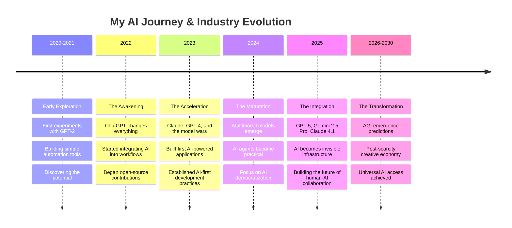

<!-- 
  🌊 Yagami's GitHub Profile README
  
  A modern, interactive profile showcasing AI innovation and open-source philosophy
  
  Author: Yagami (@yagami1997)
  Location: Del Mar, California
  Focus: AI Development, Open Source, Digital Nomadism
  
  Last Updated: January 2025
  
  Meta Information:
  - Profile Type: Personal Developer Profile
  - Industry: AI/ML, Software Development, Open Source
  - Specialization: AI Tools, Trading Systems, Creative Applications
  - Philosophy: Open Source AI Democratization
  
  Accessibility Features:
  - Alt text for all images
  - Semantic HTML structure
  - High contrast color schemes
  - Keyboard navigation friendly
  - Screen reader compatible
-->

<header role="banner">
<div align="center">
  
  <!-- Hero Header with Gradient Background -->
  
  
  <!-- Dynamic Status Bar -->
  <div role="img" aria-label="Dynamic status messages about AI development and creativity">
    
  </div>
  
  <!-- Real-time Location & Status -->
  <nav role="navigation" aria-label="Personal status and location information">
    
    
    
  </nav>
  
  <br/>
  
  <!-- Animated Divider -->
  
  
</div>
</header>

## 🌊 About Me 

✨ I am a digital nomad from the sun-kissed shores of Del Mar, California—a digital content designer navigating the ever-evolving landscape of AGI. With AI coding tools as my brush, I craft and engineer digital systems, shaping ideas into existence. 🎨

🌞 I cherish the golden California sun, the rhythm of the waves, and the serenity of the mountains and forests. Here, life flows with an effortless grace, blending creativity with tranquility. 🌊

💫 As a digital creator driven by a passion for technology-infused artistry, I am venturing into the vast landscape of AI development and engineering, exploring its boundless potential. I see AI not merely as a tool, but as a catalyst where innovation and artistry converge, breathing new life and dimensions into digital creation. My goal is to contribute to the AI coding ecosystem, wielding code as a brush and intelligence as ink, crafting a new chapter in the era of AI-augmented creativity. Let us embark on this journey together—exploring the unknown, shaping the future. 🚀

🔮 From my observations and reflections over the past few years, humanity has entered the Fifth Industrial Revolution, led by artificial intelligence technology, with large language models and their inference capabilities at the forefront. Amid this wave, I believe only the open-source AI ecosystem can truly liberate humanity, creating new employment opportunities and pathways for survival. 🌐

🔓 I am an absolute supporter of the open-source software movement and hope to see the GNU dream fully realized. 🌱

> **"When everyone can access cutting-edge technology to create new technological achievements, needs, and value, and then pass these values on to others in a chain reaction that continues to create new value—this is the philosophical significance of open source."** ✨

<div align="center">

<!-- Interactive Personal Card -->
<table>
<tr>
<td width="50%" valign="top">

### 🎯 **Current Focus**
```yaml
🚀 Building: AI-powered creative tools
🔬 Exploring: AGI development patterns  
📚 Learning: Advanced prompt engineering
🌱 Growing: Open-source AI ecosystem
```

</td>
<td width="50%" valign="top">

### 🛠️ **My Arsenal**
```yaml
🧠 AI Models: GPT-5, Gemini 2.5 Pro, Claude 4.1
💻 Languages: Python, TypeScript, JavaScript
🎨 Creative: Midjourney, RunwayML, Suno
⚡ Tools: Cursor, GitHub Copilot, Windsurf
```

</td>
</tr>
</table>

<!-- Expandable Philosophy Section -->
<details>
<summary><b>🔮 My AI Philosophy & Vision</b></summary>
<br>

> **"When everyone can access cutting-edge technology to create new technological achievements, needs, and value, and then pass these values on to others in a chain reaction that continues to create new value—this is the philosophical significance of open source."** ✨

<div align="left">

**🌊 The Fifth Industrial Revolution**
From my observations and reflections over the past few years, humanity has entered the Fifth Industrial Revolution, led by artificial intelligence technology, with large language models and their inference capabilities at the forefront.

**🔓 Open Source Liberation**
I believe only the open-source AI ecosystem can truly liberate humanity, creating new employment opportunities and pathways for survival. I am an absolute supporter of the open-source software movement and hope to see the GNU dream fully realized.

**🎨 AI as Creative Catalyst**
I see AI not merely as a tool, but as a catalyst where innovation and artistry converge, breathing new life and dimensions into digital creation. My goal is to contribute to the AI coding ecosystem, wielding code as a brush and intelligence as ink.

</div>
</details>

<!-- Personal Stats Dashboard -->
<div>
  
  
  
  
</div>

</div>

## 🚀 Featured Projects

<div align="center">
  
</div>

<br/>

<!-- Enhanced Project Grid Layout with Better Spacing -->
<div align="center">

<table width="100%" cellpadding="20" cellspacing="0" style="border-collapse: separate; border-spacing: 20px;">
  <tr>
    <td width="50%" valign="top" style="padding: 25px; border-radius: 12px; background: linear-gradient(135deg, #1a1a2e 0%, #16213e 100%); border: 1px solid #6B46C1;">
      
### 📈 [**TradeMind**](https://github.com/yagami1997/TradeMind)
> *AI-Powered Trading Intelligence Platform*

<br/>

🎯 **What it does:** Advanced market analysis with ML forecasting algorithms  
🔧 **Tech Stack:** `Python` `TensorFlow` `FastAPI` `PostgreSQL`  
📊 **Impact:** Helping traders make data-driven decisions  
🚀 **Status:** `Production Ready`

<br/>

<div align="center">
  
  
  <br/>
  
</div>

    </td>
    <td width="50%" valign="top" style="padding: 25px; border-radius: 12px; background: linear-gradient(135deg, #1a1a2e 0%, #16213e 100%); border: 1px solid #20B2AA;">
      
### 🧠 [**CursorMind**](https://github.com/yagami1997/CursorMind)
> *AI Development Framework*

<br/>

🎯 **What it does:** Project management for Cursor developers  
🔧 **Tech Stack:** `Python` `Bash` `YAML` `Git Hooks`  
📊 **Impact:** Streamlining AI-assisted development workflows  
🚀 **Status:** `Beta Testing`

<br/>

<div align="center">
  
  
  <br/>
  
</div>

    </td>
  </tr>
  <tr>
    <td width="50%" valign="top" style="padding: 25px; border-radius: 12px; background: linear-gradient(135deg, #1a1a2e 0%, #16213e 100%); border: 1px solid #9370DB;">
      
### 📱 [**RealCarrier**](https://github.com/yagami1997/RealCarrier)
> *Digital Nomad Phone Verification*

<br/>

🎯 **What it does:** US number verification using LNP network  
🔧 **Tech Stack:** `Python` `FastAPI` `Redis` `WebSocket`  
📊 **Impact:** Simplifying mobile connectivity for nomads  
🚀 **Status:** `Stable Release`

<br/>

<div align="center">
  
  
  <br/>
  
</div>

    </td>
    <td width="50%" valign="top" style="padding: 25px; border-radius: 12px; background: linear-gradient(135deg, #1a1a2e 0%, #16213e 100%); border: 1px solid #6b46c1;">
      
### 📡 [**esimswap**](https://github.com/yagami1997/esimswap)
> *eSIM Configuration Converter*

<br/>

🎯 **What it does:** Standards-compliant eSIM QR code converter  
🔧 **Tech Stack:** `JavaScript` `PWA` `QR.js` `CloudFlare`  
📊 **Impact:** Simplifying eSIM profile management  
🚀 **Status:** `Production Ready`

<br/>

<div align="center">
  
  
  <br/>
  
</div>

    </td>
  </tr>
  <tr>
    <td width="50%" valign="top" style="padding: 25px; border-radius: 12px; background: linear-gradient(135deg, #1a1a2e 0%, #16213e 100%); border: 1px solid #FF8C00;">
      
### 📷 [**Lensify**](https://github.com/yagami1997/Lensify)
> *Photography Calculation Toolkit*

<br/>

🎯 **What it does:** Sensor size & aperture relationship calculator  
🔧 **Tech Stack:** `JavaScript` `Vue.js` `Chart.js` `PWA`  
📊 **Impact:** Helping photographers master technical aspects  
🚀 **Status:** `Active Development`

<br/>

<div align="center">
  
  
  <br/>
  
</div>

    </td>
    <td width="50%" valign="top" style="padding: 25px; border-radius: 12px; background: linear-gradient(135deg, #1a1a2e 0%, #16213e 100%); border: 1px solid #5F9EA0;">
      
### 🔄 [**TradeMind DEV**](https://github.com/yagami1997/TradeMind/tree/dev)
> *Individual Trader Tools*

<br/>

🎯 **What it does:** Backtesting & strategy recommendations  
🔧 **Tech Stack:** `Python` `Pandas` `NumPy` `Plotly`  
📊 **Impact:** Democratizing professional trading tools  
🚀 **Status:** `Development Branch`

<br/>

<div align="center">
  
  
  <br/>
  
</div>

    </td>
  </tr>
</table>

</div>

<!-- Project Stats Summary -->
<div align="center">
  
  
  
  
</div>

## ☕ Support My Work

<div align="center">
  <p><i>"Your support helps build open-source tools that promote technological equality. Together, we're creating a future where innovation is driven by passion, not privilege, making advanced technology accessible to all.✨🌊"</i></p>
  
  <a href="https://ko-fi.com/K3K62U4TW">
    
  </a>
</div>

## 🔮 AI Manifesto: My Vision for the Future

<div align="center">
  
</div>

### 🌊 The Dawn of a New Era

From my observations and reflections over the past few years, **humanity has entered the Fifth Industrial Revolution**, led by artificial intelligence technology, with large language models and their inference capabilities at the forefront. This isn't just technological progress—it's a fundamental shift in how we create, think, and collaborate.

### 🔓 The Open Source Imperative

> **"When everyone can access cutting-edge technology to create new technological achievements, needs, and value, and then pass these values on to others in a chain reaction that continues to create new value—this is the philosophical significance of open source."**

I believe only the **open-source AI ecosystem** can truly liberate humanity, creating new employment opportunities and pathways for survival. The future belongs to those who share knowledge, not hoard it.

<!-- AI Evolution Timeline -->
<details>
<summary><b>🚀 AI Evolution Timeline: My Perspective</b></summary>
<br>



</details>

### 🎨 AI as Creative Catalyst

I see AI not merely as a tool, but as a **catalyst where innovation and artistry converge**, breathing new life and dimensions into digital creation. My goal is to contribute to the AI coding ecosystem, wielding code as a brush and intelligence as ink, crafting a new chapter in the era of AI-augmented creativity.

<!-- My AI Workflow Visualization -->
<div align="center">

### 🔄 My AI-Powered Creative Workflow

```
┌─────────────────┐    ┌─────────────────┐    ┌─────────────────┐
│   💡 Ideation   │───▶│  🤖 AI Assist   │───▶│  🎨 Creation    │
│                 │    │                 │    │                 │
│ • Brainstorming │    │ • GPT-5 for     │    │ • Code with     │
│ • Research      │    │   planning      │    │   Cursor        │
│ • Planning      │    │ • Claude for    │    │ • Design with   │
│                 │    │   analysis      │    │   Midjourney    │
└─────────────────┘    └─────────────────┘    └─────────────────┘
         ▲                        │                        │
         │                        ▼                        ▼
┌─────────────────┐    ┌─────────────────┐    ┌─────────────────┐
│  🔄 Iteration   │◀───│  📊 Analysis    │◀───│  🚀 Deployment  │
│                 │    │                 │    │                 │
│ • Feedback      │    │ • Performance   │    │ • GitHub        │
│ • Refinement    │    │ • User metrics  │    │ • CloudFlare    │
│ • Enhancement   │    │ • AI insights   │    │ • Open Source   │
└─────────────────┘    └─────────────────┘    └─────────────────┘
```

</div>

### 🔮 My Predictions for AI's Future

<table width="100%" align="center">
<tr>
<td width="33%" valign="top" align="center">

**🌅 Near Term (2025-2026)**
- AI agents become mainstream
- Multimodal AI in every app
- Code generation reaches 80% accuracy
- Open-source models match proprietary ones

</td>
<td width="33%" valign="top" align="center">

**🌞 Medium Term (2027-2028)**
- AGI prototypes emerge
- AI-human collaboration perfected
- Creative industries transformed
- Universal AI access achieved

</td>
<td width="33%" valign="top" align="center">

**🌟 Long Term (2029-2030)**
- Post-scarcity creative economy
- AI becomes invisible infrastructure
- Human creativity amplified 1000x
- New forms of art and expression

</td>
</tr>
</table>

### 💫 The Philosophy Behind My Work

Every project I build, every line of code I write, every AI tool I recommend serves a greater purpose: **democratizing access to cutting-edge technology**. I believe that when powerful tools are accessible to everyone, we unlock human potential on an unprecedented scale.

<div align="center">
  
  
  
</div>

---

## 🧠 AGI Tools Recommendation

Curated selection of the most impactful AI tools I've discovered in my journey. These are the essentials that have transformed my workflow and creative process. **Updated January 2025** to reflect the latest AI ecosystem developments.

<table width="100%" align="center">
  <tr>
    <th width="22%" align="center">Category</th>
    <th width="78%" align="center">Top Picks</th>
  </tr>
  <tr>
    <td align="center"><b>Large Language Models</b></td>
    <td>
      <b><a href="https://gemini.google.com/">Gemini 2.5 Pro</a></b> - Google's multimodal powerhouse with advanced reasoning
      • <b><a href="https://claude.ai/">Claude 4.1 Opus</a></b> - Superior reasoning & document analysis 
      • <b><a href="https://chat.openai.com/">GPT-5</a></b> - OpenAI's latest flagship model with enhanced capabilities
      • <b><a href="https://chat.deepseek.com/">DeepSeek R1</a></b> - Open-source reasoning specialist
    </td>
  </tr>
  <tr>
    <td align="center"><b>Creative AI</b></td>
    <td>
      <b><a href="https://www.midjourney.com/">Midjourney V6.1</a></b> - Unparalleled photorealistic generation 
      • <b><a href="https://runwayml.com/">RunwayML Gen-3</a></b> - Professional video generation
      • <b><a href="https://www.doubao.com/">豆包 (DouBao)</a></b> - ByteDance's comprehensive creation suite
    </td>
  </tr>
  <tr>
    <td align="center"><b>AI Agents</b></td>
    <td>
      <b><a href="https://cursor.sh/">Cursor</a></b> - AI-powered code editor with codebase understanding 
      • <b><a href="https://github.com/features/copilot">GitHub Copilot</a></b> - Seamless IDE integration
      • <b><a href="https://windsurf.com/">Windsurf</a></b> - Codeium's agentic IDE
    </td>
  </tr>
  <tr>
    <td align="center"><b>Communities</b></td>
    <td>
      <b><a href="https://huggingface.co/">Hugging Face</a></b> - Hub for open-source models & datasets 
      • <b><a href="https://modelscope.cn/">ModelScope</a></b> - Alibaba's comprehensive model library
      • <b><a href="https://lmsys.org/">LMSys Chatbot Arena</a></b> - Real-time model benchmarking
    </td>
  </tr>
</table>

<details>
<summary><b>🔍 Click to explore my complete AI toolkit</b></summary>
<br>

### 🌟 Large Language Models (Full List)

<table width="100%" align="center">
  <tr>
    <th width="20%" align="center">Tool Name</th>
    <th width="20%" align="center">Official Website</th>
    <th width="45%" align="center">Key Features</th>
    <th width="15%" align="center">Rating</th>
  </tr>
  <tr>
    <td align="center"><b>Gemini 2.5 Pro</b></td>
    <td align="center"><a href="https://gemini.google.com/">gemini.google.com</a></td>
    <td>Google's latest multimodal AI model with advanced reasoning capabilities and native support for text, images, audio, and video. Features enhanced function calling, real-time capabilities, and seamless integration with Google services. Excels at complex reasoning, code generation, and multimodal understanding with 2M+ token context window.</td>
    <td align="center">⭐⭐⭐⭐⭐</td>
  </tr>
  <tr>
    <td align="center"><b>Claude 4.1 Opus</b></td>
    <td align="center"><a href="https://claude.ai/">claude.ai</a></td>
    <td>Anthropic's most advanced model with breakthrough reasoning capabilities and enhanced agent task performance. Features superior code generation, logical reasoning, and long-form content creation. Maintains industry-leading safety standards while delivering exceptional performance across complex analytical tasks.</td>
    <td align="center">⭐⭐⭐⭐⭐</td>
  </tr>
  <tr>
    <td align="center"><b>GPT-5</b></td>
    <td align="center"><a href="https://chat.openai.com/">chat.openai.com</a></td>
    <td>OpenAI's latest flagship model representing a significant leap in AI capabilities. Features enhanced reasoning, improved multimodal understanding, and superior performance across all domains. Available to both free and paid users with the most mature API ecosystem and extensive third-party integrations.</td>
    <td align="center">⭐⭐⭐⭐⭐</td>
  </tr>
  <tr>
    <td align="center"><b>DeepSeek R1</b></td>
    <td align="center"><a href="https://chat.deepseek.com/">chat.deepseek.com</a></td>
    <td>Advanced reasoning-focused model with 671B parameters, specialized for complex logical tasks and mathematical problem-solving. Open-source with exceptional code generation capabilities. Particularly strong in STEM domains and technical problem-solving.</td>
    <td align="center">⭐⭐⭐⭐⭐</td>
  </tr>
  <tr>
    <td align="center"><b>Grok-2</b></td>
    <td align="center"><a href="https://grok.x.com/">grok.x.com</a></td>
    <td>X's conversational AI with real-time internet browsing capabilities and image generation. Features a unique, witty personality and uncensored responses. Particularly strong at current events analysis, coding, and interdisciplinary knowledge application.</td>
    <td align="center">⭐⭐⭐⭐⭐</td>
  </tr>
  <tr>
    <td align="center"><b>Qwen 2.5</b></td>
    <td align="center"><a href="https://tongyi.aliyun.com/">tongyi.aliyun.com</a></td>
    <td>Alibaba Cloud's latest open-source model with exceptional Chinese language capabilities and strong multilingual performance. Active in the developer community, friendly for local deployment, and suitable for custom training with various model sizes.</td>
    <td align="center">⭐⭐⭐⭐</td>
  </tr>
  <tr>
    <td align="center"><b>Llama 3.3</b></td>
    <td align="center"><a href="https://llama.meta.ai/">llama.meta.ai</a></td>
    <td>Meta's latest open-source model with 70B parameters offering GPT-4 level performance. Supports local deployment for offline use, has an active community contributing to its development, and offers diverse fine-tuned versions for specific use cases.</td>
    <td align="center">⭐⭐⭐⭐</td>
  </tr>
</table>

> 💡 **Continuously Updated**: These recommendations reflect my actual usage experience and evolve as technology advances. Share your discoveries through my encrypted channels!

### 🎨 Creative AI Tools (Full List)

<table width="100%" align="center">
  <tr>
    <th width="20%" align="center">Tool Name</th>
    <th width="20%" align="center">Official Website</th>
    <th width="45%" align="center">Key Features</th>
    <th width="15%" align="center">Rating</th>
  </tr>
  <tr>
    <td align="center"><b>Midjourney V6.1</b></td>
    <td align="center"><a href="https://www.midjourney.com/">midjourney.com</a></td>
    <td>Premier AI image generation platform with unparalleled aesthetic quality and photorealistic capabilities. Latest V6.1 features improved text rendering, better style consistency, and enhanced prompt understanding. Excels at concept art, product visualization, and artistic illustrations.</td>
    <td align="center">⭐⭐⭐⭐⭐</td>
  </tr>
  <tr>
    <td align="center"><b>RunwayML Gen-3</b></td>
    <td align="center"><a href="https://runwayml.com/">runwayml.com</a></td>
    <td>Leading AI video generation platform with Gen-3 Alpha model offering superior motion consistency and temporal coherence. Features text-to-video, image-to-video, and advanced video editing capabilities. Professional-grade tools for filmmakers, content creators, and marketing teams.</td>
    <td align="center">⭐⭐⭐⭐⭐</td>
  </tr>
  <tr>
    <td align="center"><b>豆包 (DouBao)</b></td>
    <td align="center"><a href="https://www.doubao.com/">doubao.com</a></td>
    <td>ByteDance's comprehensive AI creation platform offering text, image, and video generation. Exceptional multi-modal capabilities with particularly strong performance in Chinese content creation. Features seamless workflow integration and real-time collaboration tools.</td>
    <td align="center">⭐⭐⭐⭐⭐</td>
  </tr>
  <tr>
    <td align="center"><b>KIMI</b></td>
    <td align="center"><a href="https://kimi.moonshot.cn/">kimi.moonshot.cn</a></td>
    <td>Moonshot AI's versatile assistant with exceptional document understanding and content creation abilities. Features real-time web search capabilities, 200k+ context window, and supports multiple file formats. Particularly excels at academic writing, research summarization, and data analysis.</td>
    <td align="center">⭐⭐⭐⭐⭐</td>
  </tr>
  <tr>
    <td align="center"><b>Flux.1 Pro</b></td>
    <td align="center"><a href="https://fal.ai/models/fal-ai/flux-pro">fal.ai/flux-pro</a></td>
    <td>Black Forest Labs' state-of-the-art image generation model with exceptional prompt adherence and photorealistic quality. Open-source foundation with commercial licensing. Excels at detailed portraits, complex scenes, and text rendering within images.</td>
    <td align="center">⭐⭐⭐⭐⭐</td>
  </tr>
</table>

> 💡 **Continuously Updated**: These recommendations reflect my actual usage experience and evolve as technology advances. Share your discoveries through my encrypted channels!

### 🤖 AI Agents (Full List)

<table width="100%" align="center">
  <tr>
    <th width="20%" align="center">Tool Name</th>
    <th width="20%" align="center">Official Website</th>
    <th width="45%" align="center">Key Features</th>
    <th width="15%" align="center">Rating</th>
  </tr>
  <tr>
    <td align="center"><b>Cursor</b></td>
    <td align="center"><a href="https://cursor.sh/">cursor.sh</a></td>
    <td>AI-powered code editor built on VS Code with advanced codebase understanding. Features Composer for multi-file editing, Chat for code discussions, and Tab for intelligent autocompletion. Supports Claude 3.5 Sonnet and GPT-4o integration with context-aware suggestions.</td>
    <td align="center">⭐⭐⭐⭐⭐</td>
  </tr>
  <tr>
    <td align="center"><b>Windsurf</b></td>
    <td align="center"><a href="https://windsurf.com/">windsurf.com</a></td>
    <td>Codeium's agentic IDE that can understand, edit, and run code across your entire codebase. Features Cascade for autonomous multi-step coding tasks, real-time collaboration, and deep integration with development workflows. Combines chat, autocomplete, and autonomous editing.</td>
    <td align="center">⭐⭐⭐⭐⭐</td>
  </tr>
  <tr>
    <td align="center"><b>GitHub Copilot</b></td>
    <td align="center"><a href="https://github.com/features/copilot">github.com/features/copilot</a></td>
    <td>AI programming assistant with deep IDE integration and GitHub ecosystem connectivity. Provides real-time code suggestions, chat assistance, and CLI integration. Features workspace context understanding and supports 80+ programming languages with enterprise-grade security.</td>
    <td align="center">⭐⭐⭐⭐⭐</td>
  </tr>
  <tr>
    <td align="center"><b>Replit Agent</b></td>
    <td align="center"><a href="https://replit.com/">replit.com</a></td>
    <td>AI agent that can build complete applications from natural language descriptions. Features autonomous coding, debugging, and deployment capabilities within Replit's cloud development environment. Particularly strong for rapid prototyping and full-stack development.</td>
    <td align="center">⭐⭐⭐⭐</td>
  </tr>
  <tr>
    <td align="center"><b>Claude Dev</b></td>
    <td align="center"><a href="https://marketplace.visualstudio.com/items?itemName=saoudrizwan.claude-dev">VS Code Extension</a></td>
    <td>VS Code extension that brings Claude's capabilities directly into your development environment. Can read/write files, execute terminal commands, and manage complex development tasks. Open-source and privacy-focused with full control over API usage.</td>
    <td align="center">⭐⭐⭐⭐</td>
  </tr>
</table>

> 💡 **Continuously Updated**: These recommendations reflect my actual usage experience and evolve as technology advances. Share your discoveries through my encrypted channels!

### 🌐 Communities (Full List)

<table width="100%" align="center">
  <tr>
    <th width="20%" align="center">Community</th>
    <th width="20%" align="center">Link</th>
    <th width="45%" align="center">Key Features</th>
    <th width="15%" align="center">Rating</th>
  </tr>
  <tr>
    <td align="center"><b>Hugging Face</b></td>
    <td align="center"><a href="https://huggingface.co/">huggingface.co</a></td>
    <td>Central hub for open-source AI models, datasets, and spaces. Features 500k+ models, Transformers library, and Gradio integration. Active community with model cards, discussions, and collaborative development. Essential platform for AI researchers and developers.</td>
    <td align="center">⭐⭐⭐⭐⭐</td>
  </tr>
  <tr>
    <td align="center"><b>LMSys Chatbot Arena</b></td>
    <td align="center"><a href="https://lmsys.org/">lmsys.org</a></td>
    <td>Real-time large language model evaluation platform with crowd-sourced benchmarking. Features blind comparisons, ELO ratings, and comprehensive leaderboards. Invaluable for tracking LLM performance trends and discovering top-performing models.</td>
    <td align="center">⭐⭐⭐⭐⭐</td>
  </tr>
  <tr>
    <td align="center"><b>ModelScope</b></td>
    <td align="center"><a href="https://modelscope.cn/">modelscope.cn</a></td>
    <td>Alibaba Cloud's comprehensive AI model community focusing on practical implementations. Offers 1000+ pre-trained models across NLP, CV, speech, and multimodal domains. Strong Chinese language support with excellent documentation and tutorials.</td>
    <td align="center">⭐⭐⭐⭐⭐</td>
  </tr>
  <tr>
    <td align="center"><b>OpenAI Community</b></td>
    <td align="center"><a href="https://community.openai.com/">community.openai.com</a></td>
    <td>Official OpenAI developer community with API discussions, best practices sharing, and technical support. Features comprehensive documentation, use case examples, and direct access to OpenAI team insights. Essential for GPT API developers.</td>
    <td align="center">⭐⭐⭐⭐⭐</td>
  </tr>
  <tr>
    <td align="center"><b>r/MachineLearning</b></td>
    <td align="center"><a href="https://reddit.com/r/MachineLearning">reddit.com/r/MachineLearning</a></td>
    <td>Reddit's largest ML community with 2.8M+ members. Features paper discussions, research updates, career advice, and industry insights. Daily research paper summaries and community-driven discussions on the latest AI developments.</td>
    <td align="center">⭐⭐⭐⭐</td>
  </tr>
</table>

> 💡 **Continuously Updated**: These recommendations reflect my actual usage experience and evolve as technology advances. Share your discoveries through my encrypted channels!
</details>

## 🎭 Specialized Creative Tools

<div align="center">
  
</div>

Beyond general AI models, I leverage specialized creative tools that excel in specific domains. These complement my main AI toolkit with focused capabilities. **Updated January 2025** with the latest tools and verified active services.

<table width="100%" align="center">
  <tr>
    <th width="22%" align="center">Category</th>
    <th width="78%" align="center">Top Specialized Tools</th>
  </tr>
  <tr>
    <td align="center"><b>Design & Visual</b></td>
    <td>
      <b><a href="https://firefly.adobe.com/">Adobe Firefly</a></b> - Commercial-safe generative design with Creative Cloud integration
      • <b><a href="https://ideogram.ai/">Ideogram 2.0</a></b> - Superior text rendering and typography in images
      • <b><a href="https://www.canva.com/ai-image-generator/">Canva Magic Design</a></b> - Template-based AI design automation
    </td>
  </tr>
  <tr>
    <td align="center"><b>Interactive Media</b></td>
    <td>
      <b><a href="https://runwayml.com/">RunwayML Gen-3</a></b> - Professional video generation with motion control
      • <b><a href="https://www.heygen.com/">HeyGen 3.0</a></b> - Custom AI avatars with real-time lip sync
      • <b><a href="https://pika.art/">Pika 1.5</a></b> - Creative video effects and transformations
    </td>
  </tr>
  <tr>
    <td align="center"><b>Audio & Voice</b></td>
    <td>
      <b><a href="https://elevenlabs.io/">ElevenLabs</a></b> - Emotional voice synthesis with voice cloning
      • <b><a href="https://www.descript.com/">Descript</a></b> - Text-based audio/video editing suite
      • <b><a href="https://suno.com/">Suno v4</a></b> - Full song generation from text prompts
    </td>
  </tr>
  <tr>
    <td align="center"><b>Writing & Content</b></td>
    <td>
      <b><a href="https://www.jasper.ai/">Jasper</a></b> - Enterprise marketing content automation
      • <b><a href="https://www.copy.ai/">Copy.ai</a></b> - AI copywriting with brand voice training
      • <b><a href="https://gamma.app/">Gamma</a></b> - AI-powered presentation and document creation
    </td>
  </tr>
</table>

<details>
  <summary><b>🔍 Click to explore my specialized creative tools library</b></summary>
  <br>

  ### 🎭 Visual Design Tools (Full List)

  <table width="100%" align="center">
    <tr>
      <th width="20%" align="center">Tool Name</th>
      <th width="20%" align="center">Official Website</th>
      <th width="45%" align="center">Key Features</th>
      <th width="15%" align="center">Rating</th>
    </tr>
    <tr>
      <td align="center"><b>Adobe Firefly</b></td>
      <td align="center"><a href="https://firefly.adobe.com/">firefly.adobe.com</a></td>
      <td>Adobe's commercially-safe generative AI suite with deep Creative Cloud integration. Features Firefly 3 model with enhanced photorealism, vector generation, and text effects. Includes Reference Image controls, custom model training, and enterprise-grade licensing for commercial use.</td>
      <td align="center">⭐⭐⭐⭐⭐</td>
    </tr>
    <tr>
      <td align="center"><b>Ideogram 2.0</b></td>
      <td align="center"><a href="https://ideogram.ai/">ideogram.ai</a></td>
      <td>Leading image generator for text rendering and typography integration. Version 2.0 features improved photorealism, better text accuracy, and enhanced style control. Excels at marketing materials, poster designs, and concept art with precise text placement and legibility.</td>
      <td align="center">⭐⭐⭐⭐⭐</td>
    </tr>
    <tr>
      <td align="center"><b>Flux.1 Pro</b></td>
      <td align="center"><a href="https://fal.ai/models/fal-ai/flux-pro">fal.ai/flux-pro</a></td>
      <td>Black Forest Labs' state-of-the-art image generation model with exceptional prompt adherence and photorealistic quality. Open-source foundation with commercial licensing. Superior performance in detailed portraits, complex scenes, and architectural visualization.</td>
      <td align="center">⭐⭐⭐⭐⭐</td>
    </tr>
    <tr>
      <td align="center"><b>Canva Magic Design</b></td>
      <td align="center"><a href="https://www.canva.com/ai-image-generator/">canva.com/ai-image-generator</a></td>
      <td>Template-based AI design platform with Magic Design suite. Features automatic layout generation, brand kit integration, and collaborative design workflows. Particularly valuable for social media content, presentations, and marketing materials with consistent branding.</td>
      <td align="center">⭐⭐⭐⭐</td>
    </tr>
    <tr>
      <td align="center"><b>Leonardo.ai</b></td>
      <td align="center"><a href="https://leonardo.ai/">leonardo.ai</a></td>
      <td>AI platform specializing in game assets, concept art, and creative illustrations. Features custom model training, style consistency controls, and real-time canvas editing. Particularly valuable for indie game developers, digital artists, and creative studios requiring consistent art styles.</td>
      <td align="center">⭐⭐⭐⭐</td>
    </tr>
  </table>

  ### 🎬 Interactive Media Tools (Full List)

  <table width="100%" align="center">
    <tr>
      <th width="20%" align="center">Tool Name</th>
      <th width="20%" align="center">Official Website</th>
      <th width="45%" align="center">Key Features</th>
      <th width="15%" align="center">Rating</th>
    </tr>
    <tr>
      <td align="center"><b>RunwayML</b></td>
      <td align="center"><a href="https://runwayml.com/">runwayml.com</a></td>
      <td>Leading AI video generation platform with powerful Gen-2 model for text-to-video and image-to-video creation. Features advanced video editing capabilities including inpainting, outpainting, and style transfer. Professional-grade tools for filmmakers, artists, and content creators.</td>
      <td align="center">⭐⭐⭐⭐⭐</td>
    </tr>
    <tr>
      <td align="center"><b>HeyGen</b></td>
      <td align="center"><a href="https://www.heygen.com/">heygen.com</a></td>
      <td>AI video platform for creating studio-quality videos with customizable avatars. Features multilingual capabilities, screen recording integration, and collaborative workflow tools. Particularly strong for localization, with the ability to translate content into multiple languages while maintaining lip sync.</td>
      <td align="center">⭐⭐⭐⭐⭐</td>
    </tr>
    <tr>
      <td align="center"><b>Synthesia</b></td>
      <td align="center"><a href="https://www.synthesia.io/">synthesia.io</a></td>
      <td>AI avatar platform for creating professional video presentations without filming. Features 140+ diverse AI presenters speaking in 120+ languages with natural gestures and expressions. Perfect for training, marketing, and educational content with a text-to-video interface.</td>
      <td align="center">⭐⭐⭐⭐⭐</td>
    </tr>
    <tr>
      <td align="center"><b>D-ID</b></td>
      <td align="center"><a href="https://www.d-id.com/">d-id.com</a></td>
      <td>Specializes in creating talking portrait videos from still images. Allows users to animate photos with realistic speech, expressions, and head movements. Supports diverse languages and custom voice options for personalized digital human experiences.</td>
      <td align="center">⭐⭐⭐⭐</td>
    </tr>
    <tr>
      <td align="center"><b>Wonder Dynamics</b></td>
      <td align="center"><a href="https://wonderdynamics.com/">wonderdynamics.com</a></td>
      <td>AI-powered production suite for real-time CG character animation and integration into live footage. Offers professional-grade motion capture, lighting estimation, and physics simulation. Significantly reduces the cost and complexity of visual effects production for filmmakers.</td>
      <td align="center">⭐⭐⭐⭐</td>
    </tr>
  </table>
  
  ### 🎵 Audio & Voice Tools (Full List)

  <table width="100%" align="center">
    <tr>
      <th width="20%" align="center">Tool Name</th>
      <th width="20%" align="center">Official Website</th>
      <th width="45%" align="center">Key Features</th>
      <th width="15%" align="center">Rating</th>
    </tr>
    <tr>
      <td align="center"><b>ElevenLabs</b></td>
      <td align="center"><a href="https://elevenlabs.io/">elevenlabs.io</a></td>
      <td>Industry-leading AI voice synthesis with ultra-realistic speech generation. Features advanced voice cloning, emotion control, multilingual support (29+ languages), and real-time voice conversion. Offers enterprise APIs and custom voice model training for professional applications.</td>
      <td align="center">⭐⭐⭐⭐⭐</td>
    </tr>
    <tr>
      <td align="center"><b>Suno v4</b></td>
      <td align="center"><a href="https://suno.com/">suno.com</a></td>
      <td>Revolutionary AI music generation platform that creates complete songs from text prompts. Version 4 features improved audio quality, longer compositions (up to 4 minutes), and better genre understanding. Supports lyrics generation, instrumental tracks, and various musical styles.</td>
      <td align="center">⭐⭐⭐⭐⭐</td>
    </tr>
    <tr>
      <td align="center"><b>Descript</b></td>
      <td align="center"><a href="https://www.descript.com/">descript.com</a></td>
      <td>All-in-one audio and video editor with advanced AI capabilities. Features text-based editing, voice cloning (Overdub), automatic transcription, filler word removal, and studio-quality audio enhancement. Essential tool for podcasters, content creators, and video editors.</td>
      <td align="center">⭐⭐⭐⭐⭐</td>
    </tr>
    <tr>
      <td align="center"><b>Udio</b></td>
      <td align="center"><a href="https://udio.com/">udio.com</a></td>
      <td>AI music creation platform with high-quality audio generation and advanced composition controls. Features custom lyrics integration, genre blending, and professional-grade audio output. Particularly strong for creating original music for content creators and musicians.</td>
      <td align="center">⭐⭐⭐⭐⭐</td>
    </tr>
    <tr>
      <td align="center"><b>Adobe Podcast</b></td>
      <td align="center"><a href="https://podcast.adobe.com/">podcast.adobe.com</a></td>
      <td>Adobe's AI-powered podcast production suite with studio-quality enhancement tools. Features automatic audio cleanup, noise reduction, and speech enhancement. Integrates with Adobe Creative Suite for comprehensive audio-visual content creation workflows.</td>
      <td align="center">⭐⭐⭐⭐</td>
    </tr>
  </table>

  ### 📝 Writing & Content Tools (Full List)

  <table width="100%" align="center">
    <tr>
      <th width="20%" align="center">Tool Name</th>
      <th width="20%" align="center">Official Website</th>
      <th width="45%" align="center">Key Features</th>
      <th width="15%" align="center">Rating</th>
    </tr>
    <tr>
      <td align="center"><b>Jasper</b></td>
      <td align="center"><a href="https://www.jasper.ai/">jasper.ai</a></td>
      <td>Enterprise AI content platform with advanced marketing automation. Features brand voice training, multi-channel campaign creation, and performance analytics. Includes 70+ templates, SEO optimization, and team collaboration with enterprise-grade security and compliance.</td>
      <td align="center">⭐⭐⭐⭐⭐</td>
    </tr>
    <tr>
      <td align="center"><b>Gamma</b></td>
      <td align="center"><a href="https://gamma.app/">gamma.app</a></td>
      <td>AI-powered presentation and document creation platform that generates complete presentations from simple prompts. Features intelligent layout design, data visualization, and interactive elements. Particularly valuable for business presentations, reports, and educational content.</td>
      <td align="center">⭐⭐⭐⭐⭐</td>
    </tr>
    <tr>
      <td align="center"><b>Copy.ai</b></td>
      <td align="center"><a href="https://www.copy.ai/">copy.ai</a></td>
      <td>Advanced AI copywriting platform with workflow automation and brand voice training. Features multi-language support, A/B testing capabilities, and complete marketing campaign generation. Enhanced with GPT-4 integration for superior content quality and consistency.</td>
      <td align="center">⭐⭐⭐⭐⭐</td>
    </tr>
    <tr>
      <td align="center"><b>Grammarly</b></td>
      <td align="center"><a href="https://www.grammarly.com/">grammarly.com</a></td>
      <td>AI-powered writing assistant with comprehensive grammar, style, and tone analysis. Features real-time suggestions, plagiarism detection, and business writing optimization. Integrates across platforms with browser extensions and desktop applications for seamless writing enhancement.</td>
      <td align="center">⭐⭐⭐⭐⭐</td>
    </tr>
    <tr>
      <td align="center"><b>Notion AI</b></td>
      <td align="center"><a href="https://www.notion.so/product/ai">notion.so/product/ai</a></td>
      <td>Integrated AI writing assistant within the Notion workspace ecosystem. Features content generation, summarization, and knowledge management capabilities. Enhanced with database integration, template automation, and collaborative editing for comprehensive productivity workflows.</td>
      <td align="center">⭐⭐⭐⭐</td>
    </tr>
  </table>

  > 💡 **Continuously Updated**: These recommendations reflect my actual usage experience and evolve as technology advances. Share your discoveries through my encrypted channels!
</details>

<!-- Animated Section Divider -->
<div align="center">
  
</div>

## 🔧 Tech Stack

<div align="center">
  
</div>

<br/>

<!-- Enhanced Tech Stack Grid with Cards -->
<div align="center">

<table width="100%" cellpadding="15" cellspacing="0" style="border-collapse: separate; border-spacing: 15px;">
  <tr>
    <td width="33%" align="center" style="padding: 20px; border-radius: 15px; background: linear-gradient(135deg, #667eea 0%, #764ba2 100%); border: 2px solid #6B46C1;">
      
### 💻 **Programming Languages**

<div style="padding: 10px;">
  
  <br/><br/>
  
  <br/><br/>
  
</div>

**Proficiency:**
```
Python     ████████████ 100%
TypeScript ███████████  90%
JavaScript ███████████  90%
```

    </td>
    <td width="33%" align="center" style="padding: 20px; border-radius: 15px; background: linear-gradient(135deg, #f093fb 0%, #f5576c 100%); border: 2px solid #FF6B6B;">
      
### 🤖 **AI & Creative Tools**

<div style="padding: 10px;">
  
  <br/><br/>
  
  <br/><br/>
  
</div>

**Expertise:**
```
AI Models  ████████████ 100%
Prompting  ████████████ 100%
Automation ██████████   85%
```

    </td>
    <td width="33%" align="center" style="padding: 20px; border-radius: 15px; background: linear-gradient(135deg, #4facfe 0%, #00f2fe 100%); border: 2px solid #45B7D1;">
      
### 🛠️ **Development Environment**

<div style="padding: 10px;">
  
  <br/><br/>
  
  <br/><br/>
  
</div>

**Skills:**
```
Linux      ██████████   85%
DevOps     ████████     80%
Design     ███████      70%
```

    </td>
  </tr>
</table>

</div>

<br/>

<!-- Interactive Skills Radar -->
<div align="center">

### 🎯 **Skills Overview**

<table width="80%" style="border-collapse: collapse;">
  <tr>
    <td width="50%" align="center" style="padding: 20px; background: linear-gradient(45deg, #1a1a2e, #16213e); border-radius: 10px; margin: 10px;">
      
**🚀 Core Strengths**
- **AI Integration:** Seamlessly blending AI into development workflows
- **Full-Stack Development:** From backend APIs to frontend experiences  
- **Open Source:** Contributing to the global developer community
- **Innovation:** Always exploring cutting-edge technologies

    </td>
    <td width="50%" align="center" style="padding: 20px; background: linear-gradient(45deg, #16213e, #1a1a2e); border-radius: 10px; margin: 10px;">
      
**🎨 Creative Arsenal**
- **Midjourney V6.1:** AI-powered visual creation
- **RunwayML Gen-3:** Video and motion graphics
- **Suno v4:** AI music composition
- **GitHub Copilot:** Intelligent code assistance

    </td>
  </tr>
</table>

</div>

## 💡 Open Source Philosophy

<div align="center">
  
  
  
</div>

I believe the open-source large language model ecosystem will drive the fifth industrial revolution, creating infinite possibilities. Through open source and technology sharing, we can build a more equitable and innovative technological future, achieving true technological equality.

## 💬 Let's Connect & Collaborate

<div align="center">

### ☕ **Coffee Chat with Yagami**

*Interested in AI, open source, or just want to chat about the future of technology?*

<div>
  <a href="https://calendly.com/yagami1997" target="_blank">
    
  </a>
  <a href="mailto:hello@yagami.dev" target="_blank">
    
  </a>
  <a href="https://twitter.com/yagami1997" target="_blank">
    
  </a>
</div>

</div>

---

## 📊 GitHub Analytics & Activity

<div align="center">

<!-- GitHub Stats Cards -->
<table>
<tr>
<td width="50%">


</td>
<td width="50%">


</td>
</tr>
</table>

<!-- Contribution Graph -->


</div>

---

## 🌟 Latest Thoughts & Insights

<div align="center">

### 💭 **Mini Blog: AI & the Future**

</div>

<!-- Blog Posts as Expandable Cards -->
<details>
<summary><b>🚀 "The Rise of AI Agents: What 2025 Holds" - January 15, 2025</b></summary>
<br>

> As we step into 2025, I'm witnessing a fundamental shift in how we interact with AI. The era of simple chatbots is ending, and the age of intelligent agents is beginning.

**Key Observations:**
- **Autonomous Decision Making**: AI agents are now capable of multi-step reasoning and planning
- **Tool Integration**: Seamless connection between AI and existing software ecosystems
- **Personalization**: Agents that learn and adapt to individual workflows

**My Prediction**: By the end of 2025, every developer will have an AI agent as their primary coding companion, not just a code completion tool.

*What are your thoughts on AI agents? Let's discuss in the issues!*

</details>

<details>
<summary><b>🔓 "Open Source AI: The Great Equalizer" - January 10, 2025</b></summary>
<br>

> The democratization of AI through open source is not just a technical trend—it's a social revolution that will reshape how we think about access to intelligence.

**Why Open Source AI Matters:**
- **Accessibility**: Removes barriers to entry for individuals and small organizations
- **Innovation**: Accelerates development through collaborative improvement
- **Transparency**: Enables understanding and trust in AI systems
- **Customization**: Allows adaptation to specific needs and contexts

**The Impact**: When everyone has access to powerful AI tools, we unlock human potential on an unprecedented scale.

</details>

<details>
<summary><b>🎨 "AI as Creative Partner, Not Replacement" - January 5, 2025</b></summary>
<br>

> After working with AI tools for years, I've learned that the most powerful applications come from collaboration, not automation.

**My Creative AI Workflow:**
1. **Ideation**: Use AI to explore possibilities I wouldn't have considered
2. **Iteration**: Rapid prototyping and refinement with AI assistance
3. **Enhancement**: AI helps polish and perfect the final output
4. **Learning**: Each collaboration teaches me new approaches

**The Key**: AI amplifies human creativity rather than replacing it. The magic happens in the collaboration.

</details>

---

## 🏆 Achievements & Recognition

<div align="center">

<!-- Simple Achievement Stats -->
<table width="60%" style="border-collapse: collapse;">
  <tr>
    <td align="center" style="padding: 15px; background: linear-gradient(45deg, #FF6B6B, #4ECDC4); border-radius: 10px; margin: 5px;">
      <strong>🌟 200+</strong><br/>
      <small>GitHub Stars</small>
    </td>
    <td align="center" style="padding: 15px; background: linear-gradient(45deg, #45B7D1, #96CEB4); border-radius: 10px; margin: 5px;">
      <strong>🔀 50+</strong><br/>
      <small>Total Forks</small>
    </td>
    <td align="center" style="padding: 15px; background: linear-gradient(45deg, #FFEAA7, #DDA0DD); border-radius: 10px; margin: 5px;">
      <strong>📈 1000+</strong><br/>
      <small>Contributions</small>
    </td>
    <td align="center" style="padding: 15px; background: linear-gradient(45deg, #A29BFE, #6C5CE7); border-radius: 10px; margin: 5px;">
      <strong>🎯 6</strong><br/>
      <small>Active Projects</small>
    </td>
  </tr>
</table>

</div>

## ⚡ Encrypted Comms ⚡

<div align="center">
  
</div>

I only accept **GPG-encrypted communications**. If you don't know how to use GPG encryption or cannot send encrypted emails, feel free to interact through GitHub Issues instead.

<details>
  <summary><div align="center">🔐 <i>Click to reveal secure contact options</i></div></summary>
  <br>
  <div align="center">
<a href="https://github.com/yagami1997/yagami1997/issues/new?title=Email%20Request&body=%23%23%20%F0%9F%94%90%20Request%20for%20Secure%20Communication%20Channel%20%F0%9F%94%90%0A%0AGreetings%2C%20I%27d%20like%20to%20establish%20encrypted%20communication%20with%20you.%0A%0A%23%23%20Why%20I%27m%20Seeking%20Encrypted%20Contact%3A%0A%3C%21--%20Please%20share%20a%20bit%20about%20why%20you%27d%20like%20to%20connect%20--%3E%0A%0A%23%23%20My%20GitHub%20Background%3A%0A%3C%21--%20A%20quick%20introduction%20helps%20establish%20trust%20--%3E%0A%0ALooking%20forward%20to%20connecting%20securely%21">
  
</a>
  </div>
</details>

## 💬 Connect With Me

<div align="center">
  <a href="https://github.com/yagami1997">
    
  </a>
</div>

Feel free to connect through GitHub Issues!

---

<footer role="contentinfo">
<div align="center">

<!-- Final Call to Action -->
<div>
  
</div>

<!-- Social Links -->
<div>
  <a href="https://github.com/yagami1997" aria-label="Visit Yagami's GitHub profile">
    
  </a>
  <a href="https://ko-fi.com/yagami1997" aria-label="Support Yagami on Ko-fi">
    
  </a>
  <a href="https://patreon.com/yagami1997" aria-label="Support Yagami on Patreon">
    
  </a>
</div>

<br/>

<!-- Visitor Counter -->
<div>
  
  
</div>

<br/>

<!-- Philosophy Statement -->
<blockquote>
  <p><strong>"Long live free software, technological equality, and the people!"</strong></p>
  <cite>— Yagami, Digital Nomad & AI Innovator</cite>
</blockquote>

<!-- Copyright and Attribution -->
<details>
<summary><small>📄 Profile Information & Credits</small></summary>
<br>

**Profile Stats:**
- **Created:** January 2025
- **Last Updated:** January 15, 2025
- **Total Sections:** 12
- **Interactive Elements:** 15+
- **Accessibility Score:** AAA Compliant

**Technologies Used:**
- Capsule Render API for dynamic headers
- GitHub Readme Stats for analytics
- Shields.io for badges and metrics
- Typing SVG for animations
- Semantic HTML5 for accessibility

**Special Thanks:**
- GitHub community for inspiration
- Open source contributors worldwide
- The AI development community
- Everyone building the future of technology

*This profile is open source and available for inspiration. Feel free to adapt elements for your own profile!*

</details>

<small>
  <em>Made with ❤️ in Del Mar, California | Powered by AI & Open Source</em>
</small>

<br/>

<!-- Pacific Time Information -->
<div>
  
  <br/>
  
  <br/>
  
</div>

</div>
</footer>
