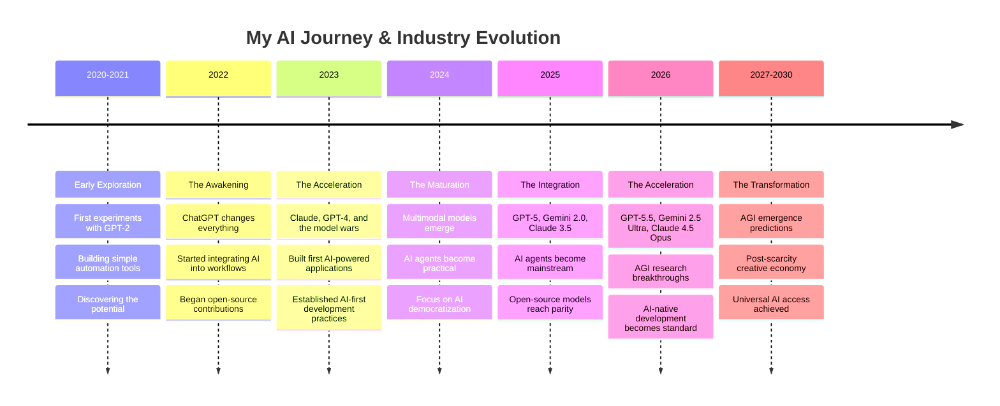

<!-- 
  🌊 Yagami's GitHub Profile README
  
  A modern, interactive profile showcasing AI innovation and open-source philosophy
  
  Author: Yagami (@yagami1997)
  Location: Del Mar, California
  Focus: AI Development, Open Source, Digital Nomadism
  
  Last Updated: January 2026
  
  Meta Information:
  - Profile Type: Personal Developer Profile
  - Industry: AI/ML, Software Development, Open Source
  - Specialization: AI Tools, Trading Systems, Creative Applications
  - Philosophy: Open Source AI Democratization
  
  Accessibility Features:
  - Alt text for all images
  - Semantic HTML structure
  - High contrast color schemes
  - Keyboard navigation friendly
  - Screen reader compatible
-->

<header role="banner">
<div align="center">
  
  <!-- Hero Header with Gradient Background -->
  
  
  <!-- Dynamic Status Bar -->
  <div role="img" aria-label="Dynamic status messages about AI development and creativity">
    
  </div>
  
  <!-- Real-time Location & Status -->
  <nav role="navigation" aria-label="Personal status and location information">
    
    
    
  </nav>
  
  <br/>
  
  <!-- Animated Divider -->
  
  
</div>
</header>

## 🌊 About Me 

✨ I am a digital nomad from the sun-kissed shores of Del Mar, California—a digital content designer navigating the ever-evolving landscape of AGI. With AI coding tools as my brush, I craft and engineer digital systems, shaping ideas into existence. 🎨

🌞 I cherish the golden California sun, the rhythm of the waves, and the serenity of the mountains and forests. Here, life flows with an effortless grace, blending creativity with tranquility. 🌊

💫 As a digital creator driven by a passion for technology-infused artistry, I am venturing into the vast landscape of AI development and engineering, exploring its boundless potential. I see AI not merely as a tool, but as a catalyst where innovation and artistry converge, breathing new life and dimensions into digital creation. My goal is to contribute to the AI coding ecosystem, wielding code as a brush and intelligence as ink, crafting a new chapter in the era of AI-augmented creativity. Let us embark on this journey together—exploring the unknown, shaping the future. 🚀

🔮 From my observations and reflections over the past few years, humanity has entered the Fifth Industrial Revolution, led by artificial intelligence technology, with large language models and their inference capabilities at the forefront. Amid this wave, I believe only the open-source AI ecosystem can truly liberate humanity, creating new employment opportunities and pathways for survival. 🌐

🔓 I am an absolute supporter of the open-source software movement and hope to see the GNU dream fully realized. 🌱

> **"When everyone can access cutting-edge technology to create new technological achievements, needs, and value, and then pass these values on to others in a chain reaction that continues to create new value—this is the philosophical significance of open source."** ✨

<div align="center">

<!-- Interactive Personal Card -->
<table>
<tr>
<td width="50%" valign="top">

### 🎯 **Current Focus**
```yaml
🚀 Building: AI-powered creative tools
🔬 Exploring: AGI development patterns  
📚 Learning: Advanced prompt engineering
🌱 Growing: Open-source AI ecosystem
```

</td>
<td width="50%" valign="top">

### 🛠️ **My Arsenal**
```yaml
🧠 AI Models: GPT-5.5, Gemini 2.5 Ultra, Claude 4.5 Opus
💻 Languages: Python, TypeScript, JavaScript
🎨 Creative: Midjourney, RunwayML, Suno
⚡ Tools: Cursor, GitHub Copilot, Windsurf
```

</td>
</tr>
</table>

<!-- Expandable Philosophy Section -->
<details>
<summary><b>🔮 My AI Philosophy & Vision</b></summary>
<br>

> **"When everyone can access cutting-edge technology to create new technological achievements, needs, and value, and then pass these values on to others in a chain reaction that continues to create new value—this is the philosophical significance of open source."** ✨

<div align="left">

**🌊 The Fifth Industrial Revolution**
From my observations and reflections over the past few years, humanity has entered the Fifth Industrial Revolution, led by artificial intelligence technology, with large language models and their inference capabilities at the forefront.

**🔓 Open Source Liberation**
I believe only the open-source AI ecosystem can truly liberate humanity, creating new employment opportunities and pathways for survival. I am an absolute supporter of the open-source software movement and hope to see the GNU dream fully realized.

**🎨 AI as Creative Catalyst**
I see AI not merely as a tool, but as a catalyst where innovation and artistry converge, breathing new life and dimensions into digital creation. My goal is to contribute to the AI coding ecosystem, wielding code as a brush and intelligence as ink.

</div>
</details>

<!-- Personal Stats Dashboard -->
<div>
  
  
  
  
</div>

</div>

## 🚀 Featured Projects

<div align="center">
  
</div>

<br/>

<table width="100%" align="center">
  <tr>
    <td width="12%" align="center"><a href="https://github.com/yagami1997/TradeMind"><b>TradeMind</b></a></td>
    <td width="30%">AI-powered trading intelligence<br/>platform with advanced market<br/>analysis and ML forecasting</td>
    <td width="18%" align="center"> </td>
    <td width="15%" align="center"></td>
    <td width="10%" align="center"><code>Production</code><br><code>Python</code></td>
    <td width="15%" align="center"></td>
  </tr>
  <tr>
    <td width="12%" align="center"><a href="https://github.com/yagami1997/CursorMind"><b>CursorMind</b></a></td>
    <td width="30%">AI development framework for<br/>project management and workflow<br/>optimization for Cursor developers</td>
    <td width="18%" align="center"> </td>
    <td width="15%" align="center"></td>
    <td width="10%" align="center"><code>Beta</code><br><code>Python</code></td>
    <td width="15%" align="center"></td>
  </tr>
  <tr>
    <td width="12%" align="center"><a href="https://github.com/yagami1997/RealCarrier"><b>RealCarrier</b></a></td>
    <td width="30%">Digital nomad phone verification<br/>system using LNP network for<br/>US number verification</td>
    <td width="18%" align="center"> </td>
    <td width="15%" align="center"></td>
    <td width="10%" align="center"><code>Stable</code><br><code>Python</code></td>
    <td width="15%" align="center"></td>
  </tr>
  <tr>
    <td width="12%" align="center"><a href="https://github.com/yagami1997/esimswap"><b>esimswap</b></a></td>
    <td width="30%">Standards-compliant eSIM profile<br/>and QR code converter with<br/>accurate configuration output</td>
    <td width="18%" align="center"> </td>
    <td width="15%" align="center"></td>
    <td width="10%" align="center"><code>Production</code><br><code>JavaScript</code></td>
    <td width="15%" align="center"></td>
  </tr>
  <tr>
    <td width="12%" align="center"><a href="https://github.com/yagami1997/Lensify"><b>Lensify</b></a></td>
    <td width="30%">Photography calculation toolkit<br/>for sensor size and aperture<br/>relationship analysis</td>
    <td width="18%" align="center"> </td>
    <td width="15%" align="center"></td>
    <td width="10%" align="center"><code>Development</code><br><code>JavaScript</code></td>
    <td width="15%" align="center"></td>
  </tr>
  <tr>
    <td width="12%" align="center"><a href="https://github.com/yagami1997/TradeMind/tree/dev"><b>TradeMind DEV</b></a></td>
    <td width="30%">Individual trader tools with<br/>backtesting capabilities and<br/>strategy recommendations</td>
    <td width="18%" align="center"> </td>
    <td width="15%" align="center"></td>
    <td width="10%" align="center"><code>Dev Branch</code><br><code>Python</code></td>
    <td width="15%" align="center"></td>
  </tr>
</table>

<!-- Project Stats Summary -->
<div align="center">
     
</div>

## ☕ Support My Work

<div align="center">

*Your support helps build open-source tools that promote technological equality.*

<br/>

<a href="https://ko-fi.com/yagami1997">
  
</a>
&nbsp;&nbsp;
<a href="https://patreon.com/yagami1997">
  
</a>

<br/><br/>

<details>
<summary>📜 <b>Why I Stopped Accepting Cryptocurrency</b></summary>
<br/>

As of **December 2025**, I no longer accept crypto sponsorships (BTC, USDT, etc.) due to compliance requirements.

| Reason | Explanation |
|:------:|:------------|
| 🔍 **Chain Analysis Risk** | Public addresses vulnerable to association with high-risk transactions |
| 📋 **Compliance Requirements** | Modern auditing requires Identity + Source + Business Rationale verification |
| 🛡️ **Asset Protection** | Verified platforms ensure regulatory compliance |

> *"In the current era, transparency is the new privacy."*

📖 [**Read Full Policy Statement →**](https://gist.github.com/yagami1997/8c7383e9714055da38fee89f8d880b87)

</details>

</div>

## 🔮 AI Manifesto: My Vision for the Future

<div align="center">
  
</div>

### 🌊 The Dawn of a New Era

From my observations and reflections over the past few years, **humanity has entered the Fifth Industrial Revolution**, led by artificial intelligence technology, with large language models and their inference capabilities at the forefront. This isn't just technological progress—it's a fundamental shift in how we create, think, and collaborate.

### 🔓 The Open Source Imperative

> **"When everyone can access cutting-edge technology to create new technological achievements, needs, and value, and then pass these values on to others in a chain reaction that continues to create new value—this is the philosophical significance of open source."**

I believe only the **open-source AI ecosystem** can truly liberate humanity, creating new employment opportunities and pathways for survival. The future belongs to those who share knowledge, not hoard it.

<!-- AI Evolution Timeline -->
<details>
<summary><b>🚀 AI Evolution Timeline: My Perspective</b></summary>
<br>


```mermaid
timeline
    title My AI Journey & Industry Evolution
    
    2020-2021 : Early Exploration
              : First experiments with GPT-2
              : Building simple automation tools
              : Discovering the potential
    
    2022      : The Awakening
              : ChatGPT changes everything
              : Started integrating AI into workflows
              : Began open-source contributions
    
    2023      : The Acceleration
              : Claude, GPT-4, and the model wars
              : Built first AI-powered applications
              : Established AI-first development practices
    
    2024      : The Maturation
              : Multimodal models emerge
              : AI agents become practical
              : Focus on AI democratization
    
    2025      : The Integration
              : GPT-5, Gemini 2.0, Claude 3.5
              : AI agents become mainstream
              : Open-source models reach parity
    
    2026      : The Acceleration
              : GPT-5.5, Gemini 2.5 Ultra, Claude 4.5 Opus
              : AGI research breakthroughs
              : AI-native development becomes standard
    
    2027-2030 : The Transformation
              : AGI emergence predictions
              : Post-scarcity creative economy
              : Universal AI access achieved
```

</details>

### 🎨 AI as Creative Catalyst

I see AI not merely as a tool, but as a **catalyst where innovation and artistry converge**, breathing new life and dimensions into digital creation. My goal is to contribute to the AI coding ecosystem, wielding code as a brush and intelligence as ink, crafting a new chapter in the era of AI-augmented creativity.

<!-- My AI Workflow Visualization -->
<div align="center">

### 🔄 My AI-Powered Creative Workflow

```
┌─────────────────┐    ┌─────────────────┐    ┌─────────────────┐
│   💡 Ideation   │───▶│  🤖 AI Assist   │───▶│  🎨 Creation    │
│                 │    │                 │    │                 │
│ • Brainstorming │    │ • GPT-5.5 for   │    │ • Code with     │
│ • Research      │    │   planning      │    │   Cursor        │
│ • Planning      │    │ • Claude 4.5    │    │ • Design with   │
│                 │    │   for analysis  │    │   Midjourney V7 │
└─────────────────┘    └─────────────────┘    └─────────────────┘
         ▲                        │                        │
         │                        ▼                        ▼
┌─────────────────┐    ┌─────────────────┐    ┌─────────────────┐
│  🔄 Iteration   │◀───│  📊 Analysis    │◀───│  🚀 Deployment  │
│                 │    │                 │    │                 │
│ • Feedback      │    │ • Performance   │    │ • GitHub        │
│ • Refinement    │    │ • User metrics  │    │ • CloudFlare    │
│ • Enhancement   │    │ • AI insights   │    │ • Open Source   │
└─────────────────┘    └─────────────────┘    └─────────────────┘
```

</div>

### 🔮 My Predictions for AI's Future

<table width="100%" align="center">
<tr>
<td width="33%" valign="top" align="center">

**🌅 Near Term (2025-2026)**
- AI agents become mainstream
- Multimodal AI in every app
- Code generation reaches 80% accuracy
- Open-source models match proprietary ones

</td>
<td width="33%" valign="top" align="center">

**🌞 Medium Term (2027-2028)**
- AGI prototypes emerge
- AI-human collaboration perfected
- Creative industries transformed
- Universal AI access achieved

</td>
<td width="33%" valign="top" align="center">

**🌟 Long Term (2029-2030)**
- Post-scarcity creative economy
- AI becomes invisible infrastructure
- Human creativity amplified 1000x
- New forms of art and expression

</td>
</tr>
</table>

### 💫 The Philosophy Behind My Work

Every project I build, every line of code I write, every AI tool I recommend serves a greater purpose: **democratizing access to cutting-edge technology**. I believe that when powerful tools are accessible to everyone, we unlock human potential on an unprecedented scale.

<div align="center">
  
  
  
</div>

---

## 🧠 AGI Tools Recommendation

Curated selection of the most impactful AI tools I've discovered in my journey. These are the essentials that have transformed my workflow and creative process. **Updated January 2026** to reflect the latest AI ecosystem developments.

<table width="100%" align="center">
  <tr>
    <th width="22%" align="center">Category</th>
    <th width="78%" align="center">Top Picks</th>
  </tr>
  <tr>
    <td align="center"><b>Large Language Models</b></td>
    <td>
      <b><a href="https://gemini.google.com/">Gemini 2.5 Ultra</a></b> - Google's most capable multimodal model with 2M+ context
      • <b><a href="https://claude.ai/">Claude 4.5 Opus</a></b> - Anthropic's frontier model with agentic capabilities 
      • <b><a href="https://chat.openai.com/">GPT-5.5</a></b> - OpenAI's latest with enhanced reasoning and tool use
      • <b><a href="https://chat.deepseek.com/">DeepSeek R2</a></b> - Open-source reasoning leader with 1T parameters
    </td>
  </tr>
  <tr>
    <td align="center"><b>Creative AI</b></td>
    <td>
      <b><a href="https://www.midjourney.com/">Midjourney V7</a></b> - Industry-leading photorealistic and artistic generation 
      • <b><a href="https://runwayml.com/">RunwayML Gen-4</a></b> - Professional video generation with motion control
      • <b><a href="https://www.doubao.com/">豆包 (DouBao)</a></b> - ByteDance's comprehensive creation suite
    </td>
  </tr>
  <tr>
    <td align="center"><b>AI Agents</b></td>
    <td>
      <b><a href="https://cursor.sh/">Cursor</a></b> - AI-powered code editor with codebase understanding 
      • <b><a href="https://github.com/features/copilot">GitHub Copilot</a></b> - Seamless IDE integration
      • <b><a href="https://windsurf.com/">Windsurf</a></b> - Codeium's agentic IDE
    </td>
  </tr>
  <tr>
    <td align="center"><b>Communities</b></td>
    <td>
      <b><a href="https://huggingface.co/">Hugging Face</a></b> - Hub for open-source models & datasets 
      • <b><a href="https://modelscope.cn/">ModelScope</a></b> - Alibaba's comprehensive model library
      • <b><a href="https://lmsys.org/">LMSys Chatbot Arena</a></b> - Real-time model benchmarking
    </td>
  </tr>
</table>

<details>
<summary><b>🔍 Click to explore my complete AI toolkit</b></summary>
<br>

### 🌟 Large Language Models (Full List)

<table width="100%" align="center">
  <tr>
    <th width="20%" align="center">Tool Name</th>
    <th width="20%" align="center">Official Website</th>
    <th width="45%" align="center">Key Features</th>
    <th width="15%" align="center">Rating</th>
  </tr>
  <tr>
    <td align="center"><b>Gemini 2.5 Ultra</b></td>
    <td align="center"><a href="https://gemini.google.com/">gemini.google.com</a></td>
    <td>Google's most capable multimodal AI model with breakthrough performance across text, images, audio, video, and code. Features 2M+ token context window, native tool use, and real-time streaming capabilities. Excels at complex multi-step reasoning, agentic tasks, and seamless Google ecosystem integration.</td>
    <td align="center">⭐⭐⭐⭐⭐</td>
  </tr>
  <tr>
    <td align="center"><b>Claude 4.5 Opus</b></td>
    <td align="center"><a href="https://claude.ai/">claude.ai</a></td>
    <td>Anthropic's frontier model with industry-leading agentic capabilities and autonomous task completion. Features enhanced computer use, superior code generation with self-debugging, and extended thinking for complex problems. Sets new standards for AI safety while delivering exceptional performance.</td>
    <td align="center">⭐⭐⭐⭐⭐</td>
  </tr>
  <tr>
    <td align="center"><b>GPT-5.5</b></td>
    <td align="center"><a href="https://chat.openai.com/">chat.openai.com</a></td>
    <td>OpenAI's latest flagship with significantly enhanced reasoning, native tool use, and multimodal generation capabilities. Features improved instruction following, reduced hallucinations, and seamless integration with the extensive OpenAI ecosystem. Available across ChatGPT and API with enterprise-grade reliability.</td>
    <td align="center">⭐⭐⭐⭐⭐</td>
  </tr>
  <tr>
    <td align="center"><b>DeepSeek R2</b></td>
    <td align="center"><a href="https://chat.deepseek.com/">chat.deepseek.com</a></td>
    <td>Next-generation open-source reasoning model with 1T+ parameters, achieving frontier-level performance on mathematical and coding benchmarks. Features efficient MoE architecture, extended context, and exceptional cost-efficiency. Leading the open-source AI movement with full model weights available.</td>
    <td align="center">⭐⭐⭐⭐⭐</td>
  </tr>
  <tr>
    <td align="center"><b>Grok-3</b></td>
    <td align="center"><a href="https://grok.x.com/">grok.x.com</a></td>
    <td>xAI's most advanced model with real-time X platform integration and uncensored responses. Features native image understanding and generation, live information access, and distinctive conversational style. Particularly strong at current events analysis, coding, and creative tasks.</td>
    <td align="center">⭐⭐⭐⭐⭐</td>
  </tr>
  <tr>
    <td align="center"><b>Qwen 3.0</b></td>
    <td align="center"><a href="https://tongyi.aliyun.com/">tongyi.aliyun.com</a></td>
    <td>Alibaba Cloud's flagship open-source model with exceptional multilingual capabilities and coding performance. Features efficient architecture for local deployment, comprehensive fine-tuning ecosystem, and strong performance across 100+ languages. Leading choice for enterprise AI deployment in Asia.</td>
    <td align="center">⭐⭐⭐⭐⭐</td>
  </tr>
  <tr>
    <td align="center"><b>Llama 4</b></td>
    <td align="center"><a href="https://llama.meta.ai/">llama.meta.ai</a></td>
    <td>Meta's breakthrough open-source model achieving GPT-5 level performance with efficient architecture. Features native multimodal understanding, extended context, and industry-leading open weights. Massive ecosystem with thousands of community fine-tunes and seamless deployment options.</td>
    <td align="center">⭐⭐⭐⭐⭐</td>
  </tr>
</table>

> 💡 **Continuously Updated**: These recommendations reflect my actual usage experience and evolve as technology advances. Share your discoveries through my encrypted channels!

### 🎨 Creative AI Tools (Full List)

<table width="100%" align="center">
  <tr>
    <th width="20%" align="center">Tool Name</th>
    <th width="20%" align="center">Official Website</th>
    <th width="45%" align="center">Key Features</th>
    <th width="15%" align="center">Rating</th>
  </tr>
  <tr>
    <td align="center"><b>Midjourney V7</b></td>
    <td align="center"><a href="https://www.midjourney.com/">midjourney.com</a></td>
    <td>Industry-leading AI image generation with unprecedented photorealism and artistic control. V7 features native 3D understanding, perfect text rendering, video generation capabilities, and web-based editor. Excels at concept art, product visualization, architecture, and cinematic imagery.</td>
    <td align="center">⭐⭐⭐⭐⭐</td>
  </tr>
  <tr>
    <td align="center"><b>RunwayML Gen-4</b></td>
    <td align="center"><a href="https://runwayml.com/">runwayml.com</a></td>
    <td>Next-generation video AI platform with cinematic quality output and precise motion control. Features text-to-video, image-to-video, video-to-video transformations, and professional editing suite. Industry standard for filmmakers, advertisers, and content creators with extended duration support.</td>
    <td align="center">⭐⭐⭐⭐⭐</td>
  </tr>
  <tr>
    <td align="center"><b>豆包 (DouBao)</b></td>
    <td align="center"><a href="https://www.doubao.com/">doubao.com</a></td>
    <td>ByteDance's comprehensive AI creation platform offering text, image, and video generation. Exceptional multi-modal capabilities with particularly strong performance in Chinese content creation. Features seamless workflow integration and real-time collaboration tools.</td>
    <td align="center">⭐⭐⭐⭐⭐</td>
  </tr>
  <tr>
    <td align="center"><b>KIMI k2</b></td>
    <td align="center"><a href="https://kimi.moonshot.cn/">kimi.moonshot.cn</a></td>
    <td>Moonshot AI's upgraded assistant with 2M+ context window and enhanced multimodal capabilities. Features advanced document analysis, real-time web search, code execution, and file processing. Particularly excels at research synthesis, long-form content creation, and complex data analysis.</td>
    <td align="center">⭐⭐⭐⭐⭐</td>
  </tr>
  <tr>
    <td align="center"><b>Flux 2.0 Pro</b></td>
    <td align="center"><a href="https://fal.ai/models/fal-ai/flux-pro">fal.ai/flux-pro</a></td>
    <td>Black Forest Labs' next-generation image model with state-of-the-art photorealism and prompt adherence. Features native video generation, 3D-aware composition, and perfect text rendering. Open-source foundation with commercial licensing and extensive community fine-tunes.</td>
    <td align="center">⭐⭐⭐⭐⭐</td>
  </tr>
</table>

> 💡 **Continuously Updated**: These recommendations reflect my actual usage experience and evolve as technology advances. Share your discoveries through my encrypted channels!

### 🤖 AI Agents (Full List)

<table width="100%" align="center">
  <tr>
    <th width="20%" align="center">Tool Name</th>
    <th width="20%" align="center">Official Website</th>
    <th width="45%" align="center">Key Features</th>
    <th width="15%" align="center">Rating</th>
  </tr>
  <tr>
    <td align="center"><b>Cursor</b></td>
    <td align="center"><a href="https://cursor.sh/">cursor.sh</a></td>
    <td>Leading AI-native code editor with deep codebase understanding and agentic capabilities. Features Agent mode for autonomous development, Composer for multi-file editing, and Background Agents for continuous tasks. Supports Claude 4.5, GPT-5.5, and custom model integration.</td>
    <td align="center">⭐⭐⭐⭐⭐</td>
  </tr>
  <tr>
    <td align="center"><b>Windsurf</b></td>
    <td align="center"><a href="https://windsurf.com/">windsurf.com</a></td>
    <td>Codeium's agentic IDE with Cascade for autonomous multi-step coding across entire codebases. Features real-time collaboration, integrated terminal execution, and seamless deployment workflows. Combines intelligent autocomplete, chat, and autonomous editing in one platform.</td>
    <td align="center">⭐⭐⭐⭐⭐</td>
  </tr>
  <tr>
    <td align="center"><b>GitHub Copilot</b></td>
    <td align="center"><a href="https://github.com/features/copilot">github.com/features/copilot</a></td>
    <td>GitHub's AI programming platform with Copilot Workspace for autonomous development and deep repository integration. Features multi-file editing, PR assistance, CLI integration, and enterprise security. Supports 100+ programming languages with context-aware suggestions.</td>
    <td align="center">⭐⭐⭐⭐⭐</td>
  </tr>
  <tr>
    <td align="center"><b>Replit Agent</b></td>
    <td align="center"><a href="https://replit.com/">replit.com</a></td>
    <td>AI agent that builds and deploys complete applications from natural language. Features autonomous full-stack development, real-time debugging, and one-click deployment. Exceptional for rapid prototyping, learning, and shipping production apps without DevOps complexity.</td>
    <td align="center">⭐⭐⭐⭐⭐</td>
  </tr>
  <tr>
    <td align="center"><b>Cline</b></td>
    <td align="center"><a href="https://github.com/cline/cline">github.com/cline/cline</a></td>
    <td>Open-source AI coding agent for VS Code with autonomous file operations and terminal execution. Features MCP integration, computer use capabilities, and support for any LLM. Privacy-focused with full transparency and community-driven development.</td>
    <td align="center">⭐⭐⭐⭐⭐</td>
  </tr>
</table>

> 💡 **Continuously Updated**: These recommendations reflect my actual usage experience and evolve as technology advances. Share your discoveries through my encrypted channels!

### 🌐 Communities (Full List)

<table width="100%" align="center">
  <tr>
    <th width="20%" align="center">Community</th>
    <th width="20%" align="center">Link</th>
    <th width="45%" align="center">Key Features</th>
    <th width="15%" align="center">Rating</th>
  </tr>
  <tr>
    <td align="center"><b>Hugging Face</b></td>
    <td align="center"><a href="https://huggingface.co/">huggingface.co</a></td>
    <td>Central hub for open-source AI models, datasets, and spaces. Features 500k+ models, Transformers library, and Gradio integration. Active community with model cards, discussions, and collaborative development. Essential platform for AI researchers and developers.</td>
    <td align="center">⭐⭐⭐⭐⭐</td>
  </tr>
  <tr>
    <td align="center"><b>LMSys Chatbot Arena</b></td>
    <td align="center"><a href="https://lmsys.org/">lmsys.org</a></td>
    <td>Real-time large language model evaluation platform with crowd-sourced benchmarking. Features blind comparisons, ELO ratings, and comprehensive leaderboards. Invaluable for tracking LLM performance trends and discovering top-performing models.</td>
    <td align="center">⭐⭐⭐⭐⭐</td>
  </tr>
  <tr>
    <td align="center"><b>ModelScope</b></td>
    <td align="center"><a href="https://modelscope.cn/">modelscope.cn</a></td>
    <td>Alibaba Cloud's comprehensive AI model community focusing on practical implementations. Offers 1000+ pre-trained models across NLP, CV, speech, and multimodal domains. Strong Chinese language support with excellent documentation and tutorials.</td>
    <td align="center">⭐⭐⭐⭐⭐</td>
  </tr>
  <tr>
    <td align="center"><b>OpenAI Community</b></td>
    <td align="center"><a href="https://community.openai.com/">community.openai.com</a></td>
    <td>Official OpenAI developer community with API discussions, best practices sharing, and technical support. Features comprehensive documentation, use case examples, and direct access to OpenAI team insights. Essential for GPT API developers.</td>
    <td align="center">⭐⭐⭐⭐⭐</td>
  </tr>
  <tr>
    <td align="center"><b>r/MachineLearning</b></td>
    <td align="center"><a href="https://reddit.com/r/MachineLearning">reddit.com/r/MachineLearning</a></td>
    <td>Reddit's largest ML community with 2.8M+ members. Features paper discussions, research updates, career advice, and industry insights. Daily research paper summaries and community-driven discussions on the latest AI developments.</td>
    <td align="center">⭐⭐⭐⭐</td>
  </tr>
</table>

> 💡 **Continuously Updated**: These recommendations reflect my actual usage experience and evolve as technology advances. Share your discoveries through my encrypted channels!
</details>

## 🎭 Specialized Creative Tools

<div align="center">
  
</div>

Beyond general AI models, I leverage specialized creative tools that excel in specific domains. These complement my main AI toolkit with focused capabilities. **Updated January 2026** with the latest tools and verified active services.

<table width="100%" align="center">
  <tr>
    <th width="22%" align="center">Category</th>
    <th width="78%" align="center">Top Specialized Tools</th>
  </tr>
  <tr>
    <td align="center"><b>Design & Visual</b></td>
    <td>
      <b><a href="https://firefly.adobe.com/">Adobe Firefly</a></b> - Commercial-safe generative design with Creative Cloud integration
      • <b><a href="https://ideogram.ai/">Ideogram 3.0</a></b> - Superior text rendering and typography in images
      • <b><a href="https://www.canva.com/ai-image-generator/">Canva Magic Design</a></b> - Template-based AI design automation
    </td>
  </tr>
  <tr>
    <td align="center"><b>Interactive Media</b></td>
    <td>
      <b><a href="https://runwayml.com/">RunwayML Gen-4</a></b> - Professional video generation with motion control
      • <b><a href="https://www.heygen.com/">HeyGen 5.0</a></b> - Custom AI avatars with real-time lip sync
      • <b><a href="https://pika.art/">Pika 2.0</a></b> - Creative video effects and transformations
    </td>
  </tr>
  <tr>
    <td align="center"><b>Audio & Voice</b></td>
    <td>
      <b><a href="https://elevenlabs.io/">ElevenLabs</a></b> - Emotional voice synthesis with voice cloning
      • <b><a href="https://www.descript.com/">Descript</a></b> - Text-based audio/video editing suite
      • <b><a href="https://suno.com/">Suno v5</a></b> - Full song generation from text prompts
    </td>
  </tr>
  <tr>
    <td align="center"><b>Writing & Content</b></td>
    <td>
      <b><a href="https://www.jasper.ai/">Jasper</a></b> - Enterprise marketing content automation
      • <b><a href="https://www.copy.ai/">Copy.ai</a></b> - AI copywriting with brand voice training
      • <b><a href="https://gamma.app/">Gamma</a></b> - AI-powered presentation and document creation
    </td>
  </tr>
</table>

<details>
  <summary><b>🔍 Click to explore my specialized creative tools library</b></summary>
  <br>

  ### 🎭 Visual Design Tools (Full List)

  <table width="100%" align="center">
    <tr>
      <th width="20%" align="center">Tool Name</th>
      <th width="20%" align="center">Official Website</th>
      <th width="45%" align="center">Key Features</th>
      <th width="15%" align="center">Rating</th>
    </tr>
    <tr>
      <td align="center"><b>Adobe Firefly</b></td>
      <td align="center"><a href="https://firefly.adobe.com/">firefly.adobe.com</a></td>
      <td>Adobe's commercially-safe generative AI suite with deep Creative Cloud integration. Features Firefly 4 model with native video generation, enhanced photorealism, and 3D asset creation. Includes Structure Reference, custom model training, and enterprise-grade licensing for commercial use.</td>
      <td align="center">⭐⭐⭐⭐⭐</td>
    </tr>
    <tr>
      <td align="center"><b>Ideogram 3.0</b></td>
      <td align="center"><a href="https://ideogram.ai/">ideogram.ai</a></td>
      <td>Industry-leading image generator for text rendering and typography. Version 3.0 features cinematic photorealism, perfect text accuracy, and Canvas editing mode. Excels at marketing materials, poster designs, and concept art with unmatched text placement and legibility.</td>
      <td align="center">⭐⭐⭐⭐⭐</td>
    </tr>
    <tr>
      <td align="center"><b>Flux 2.0 Pro</b></td>
      <td align="center"><a href="https://fal.ai/models/fal-ai/flux-pro">fal.ai/flux-pro</a></td>
      <td>Black Forest Labs' next-generation image model with exceptional prompt adherence and photorealistic quality. Features native video generation, ControlNet integration, and 3D-aware composition. Open-source foundation with extensive community ecosystem.</td>
      <td align="center">⭐⭐⭐⭐⭐</td>
    </tr>
    <tr>
      <td align="center"><b>Canva Magic Design</b></td>
      <td align="center"><a href="https://www.canva.com/ai-image-generator/">canva.com/ai-image-generator</a></td>
      <td>Template-based AI design platform with Magic Design suite. Features automatic layout generation, brand kit integration, and collaborative design workflows. Particularly valuable for social media content, presentations, and marketing materials with consistent branding.</td>
      <td align="center">⭐⭐⭐⭐</td>
    </tr>
    <tr>
      <td align="center"><b>Leonardo.ai</b></td>
      <td align="center"><a href="https://leonardo.ai/">leonardo.ai</a></td>
      <td>AI platform specializing in game assets, concept art, and creative illustrations. Features custom model training, style consistency controls, and real-time canvas editing. Particularly valuable for indie game developers, digital artists, and creative studios requiring consistent art styles.</td>
      <td align="center">⭐⭐⭐⭐</td>
    </tr>
  </table>

  ### 🎬 Interactive Media Tools (Full List)

  <table width="100%" align="center">
    <tr>
      <th width="20%" align="center">Tool Name</th>
      <th width="20%" align="center">Official Website</th>
      <th width="45%" align="center">Key Features</th>
      <th width="15%" align="center">Rating</th>
    </tr>
    <tr>
      <td align="center"><b>RunwayML Gen-4</b></td>
      <td align="center"><a href="https://runwayml.com/">runwayml.com</a></td>
      <td>Next-generation AI video platform with cinematic quality and precise motion control. Features text-to-video, image-to-video, video extension, and professional editing suite. Industry standard for filmmakers and content creators with extended duration and 4K output support.</td>
      <td align="center">⭐⭐⭐⭐⭐</td>
    </tr>
    <tr>
      <td align="center"><b>HeyGen 5.0</b></td>
      <td align="center"><a href="https://www.heygen.com/">heygen.com</a></td>
      <td>Enterprise AI video platform with photorealistic avatars and real-time streaming capabilities. Features instant avatar cloning, 175+ language support, and seamless API integration. Leading solution for personalized video at scale with enterprise security compliance.</td>
      <td align="center">⭐⭐⭐⭐⭐</td>
    </tr>
    <tr>
      <td align="center"><b>Synthesia</b></td>
      <td align="center"><a href="https://www.synthesia.io/">synthesia.io</a></td>
      <td>AI avatar platform for creating professional video presentations without filming. Features 140+ diverse AI presenters speaking in 120+ languages with natural gestures and expressions. Perfect for training, marketing, and educational content with a text-to-video interface.</td>
      <td align="center">⭐⭐⭐⭐⭐</td>
    </tr>
    <tr>
      <td align="center"><b>D-ID</b></td>
      <td align="center"><a href="https://www.d-id.com/">d-id.com</a></td>
      <td>Specializes in creating talking portrait videos from still images. Allows users to animate photos with realistic speech, expressions, and head movements. Supports diverse languages and custom voice options for personalized digital human experiences.</td>
      <td align="center">⭐⭐⭐⭐</td>
    </tr>
    <tr>
      <td align="center"><b>Wonder Dynamics</b></td>
      <td align="center"><a href="https://wonderdynamics.com/">wonderdynamics.com</a></td>
      <td>AI-powered production suite for real-time CG character animation and integration into live footage. Offers professional-grade motion capture, lighting estimation, and physics simulation. Significantly reduces the cost and complexity of visual effects production for filmmakers.</td>
      <td align="center">⭐⭐⭐⭐</td>
    </tr>
  </table>
  
  ### 🎵 Audio & Voice Tools (Full List)

  <table width="100%" align="center">
    <tr>
      <th width="20%" align="center">Tool Name</th>
      <th width="20%" align="center">Official Website</th>
      <th width="45%" align="center">Key Features</th>
      <th width="15%" align="center">Rating</th>
    </tr>
    <tr>
      <td align="center"><b>ElevenLabs</b></td>
      <td align="center"><a href="https://elevenlabs.io/">elevenlabs.io</a></td>
      <td>Industry-leading AI voice synthesis with ultra-realistic speech generation. Features advanced voice cloning, emotion control, multilingual support (29+ languages), and real-time voice conversion. Offers enterprise APIs and custom voice model training for professional applications.</td>
      <td align="center">⭐⭐⭐⭐⭐</td>
    </tr>
    <tr>
      <td align="center"><b>Suno v5</b></td>
      <td align="center"><a href="https://suno.com/">suno.com</a></td>
      <td>Industry-leading AI music generation platform creating studio-quality songs from text prompts. Version 5 features professional audio fidelity, 10+ minute compositions, and precise style control. Supports custom voice training, stem separation, and commercial licensing for creators.</td>
      <td align="center">⭐⭐⭐⭐⭐</td>
    </tr>
    <tr>
      <td align="center"><b>Descript</b></td>
      <td align="center"><a href="https://www.descript.com/">descript.com</a></td>
      <td>All-in-one audio and video editor with advanced AI capabilities. Features text-based editing, voice cloning (Overdub), automatic transcription, filler word removal, and studio-quality audio enhancement. Essential tool for podcasters, content creators, and video editors.</td>
      <td align="center">⭐⭐⭐⭐⭐</td>
    </tr>
    <tr>
      <td align="center"><b>Udio</b></td>
      <td align="center"><a href="https://udio.com/">udio.com</a></td>
      <td>AI music creation platform with high-quality audio generation and advanced composition controls. Features custom lyrics integration, genre blending, and professional-grade audio output. Particularly strong for creating original music for content creators and musicians.</td>
      <td align="center">⭐⭐⭐⭐⭐</td>
    </tr>
    <tr>
      <td align="center"><b>Adobe Podcast</b></td>
      <td align="center"><a href="https://podcast.adobe.com/">podcast.adobe.com</a></td>
      <td>Adobe's AI-powered podcast production suite with studio-quality enhancement tools. Features automatic audio cleanup, noise reduction, and speech enhancement. Integrates with Adobe Creative Suite for comprehensive audio-visual content creation workflows.</td>
      <td align="center">⭐⭐⭐⭐</td>
    </tr>
  </table>

  ### 📝 Writing & Content Tools (Full List)

  <table width="100%" align="center">
    <tr>
      <th width="20%" align="center">Tool Name</th>
      <th width="20%" align="center">Official Website</th>
      <th width="45%" align="center">Key Features</th>
      <th width="15%" align="center">Rating</th>
    </tr>
    <tr>
      <td align="center"><b>Jasper</b></td>
      <td align="center"><a href="https://www.jasper.ai/">jasper.ai</a></td>
      <td>Enterprise AI content platform with advanced marketing automation. Features brand voice training, multi-channel campaign creation, and performance analytics. Includes 70+ templates, SEO optimization, and team collaboration with enterprise-grade security and compliance.</td>
      <td align="center">⭐⭐⭐⭐⭐</td>
    </tr>
    <tr>
      <td align="center"><b>Gamma</b></td>
      <td align="center"><a href="https://gamma.app/">gamma.app</a></td>
      <td>AI-powered presentation and document creation platform that generates complete presentations from simple prompts. Features intelligent layout design, data visualization, and interactive elements. Particularly valuable for business presentations, reports, and educational content.</td>
      <td align="center">⭐⭐⭐⭐⭐</td>
    </tr>
    <tr>
      <td align="center"><b>Copy.ai</b></td>
      <td align="center"><a href="https://www.copy.ai/">copy.ai</a></td>
      <td>Advanced AI copywriting platform with workflow automation and brand voice training. Features multi-language support, A/B testing capabilities, and complete marketing campaign generation. Enhanced with GPT-5.5 and Claude 4.5 integration for superior content quality and consistency.</td>
      <td align="center">⭐⭐⭐⭐⭐</td>
    </tr>
    <tr>
      <td align="center"><b>Grammarly</b></td>
      <td align="center"><a href="https://www.grammarly.com/">grammarly.com</a></td>
      <td>AI-powered writing assistant with comprehensive grammar, style, and tone analysis. Features real-time suggestions, plagiarism detection, and business writing optimization. Integrates across platforms with browser extensions and desktop applications for seamless writing enhancement.</td>
      <td align="center">⭐⭐⭐⭐⭐</td>
    </tr>
    <tr>
      <td align="center"><b>Notion AI</b></td>
      <td align="center"><a href="https://www.notion.so/product/ai">notion.so/product/ai</a></td>
      <td>Integrated AI writing assistant within the Notion workspace ecosystem. Features content generation, summarization, and knowledge management capabilities. Enhanced with database integration, template automation, and collaborative editing for comprehensive productivity workflows.</td>
      <td align="center">⭐⭐⭐⭐</td>
    </tr>
  </table>

  > 💡 **Continuously Updated**: These recommendations reflect my actual usage experience and evolve as technology advances. Share your discoveries through my encrypted channels!
</details>

<!-- Animated Section Divider -->
<div align="center">
  
</div>

## 🔧 Tech Stack

<div align="center">

[](https://www.python.org/) [](https://www.typescriptlang.org/) [](https://developer.mozilla.org/en-US/docs/Web/JavaScript) [](https://gemini.google.com/) [](https://openai.com/) [](https://claude.ai/) [](https://cursor.sh/) [](https://ubuntu.com/)

</div>

## 💡 Open Source Philosophy

<div align="center">
  
  
  
</div>

I believe the open-source large language model ecosystem will drive the fifth industrial revolution, creating infinite possibilities. Through open source and technology sharing, we can build a more equitable and innovative technological future, achieving true technological equality.

---

## 📊 GitHub Analytics & Activity

<div align="center">

<!-- GitHub Stats Cards -->
<a href="https://github.com/yagami1997">
  
  
</a>

<!-- Contribution Graph -->


</div>

---

## 🌟 Latest Thoughts & Insights

<div align="center">

### 💭 **Mini Blog: AI & the Future**

</div>

<!-- Blog Posts as Expandable Cards -->
<details>
<summary><b>🚀 "2026: The Year AI Agents Became Essential" - January 14, 2026</b></summary>
<br>

> As we enter 2026, AI agents have fundamentally transformed software development. What was experimental a year ago is now the standard way we build.

**Key Developments:**
- **Autonomous Development**: AI agents now handle entire feature implementations end-to-end
- **Multi-Agent Collaboration**: Teams of specialized AI agents working together on complex projects
- **Self-Improving Systems**: Agents that learn from codebases and improve their suggestions over time

**Reality Check**: My prediction came true—every serious developer now works alongside AI agents. The question is no longer "if" but "how effectively" you leverage them.

*How has your workflow evolved with AI agents? Share in the issues!*

</details>

<details>
<summary><b>🔓 "Open Source AI Wins: DeepSeek R2 Changes Everything" - January 10, 2026</b></summary>
<br>

> The release of DeepSeek R2 and Llama 4 proved what I've always believed: open-source AI can match and exceed proprietary models.

**What Changed in 2025-2026:**
- **Performance Parity**: Open models now compete with GPT-5.5 and Claude 4.5 on most benchmarks
- **Cost Revolution**: Running frontier-level AI locally is now accessible to individuals
- **Enterprise Adoption**: Major companies shifting from proprietary to open-source AI stacks
- **Community Innovation**: Thousands of specialized fine-tunes for every domain

**The Impact**: The GNU dream for AI is becoming reality. Access to intelligence is being democratized.

</details>

<details>
<summary><b>🎨 "Creative AI Reaches Inflection Point" - January 5, 2026</b></summary>
<br>

> 2025 was the year creative AI tools became indistinguishable from human output. 2026 is about mastering these tools.

**The New Creative Stack:**
1. **Ideation**: AI generates hundreds of concepts in seconds
2. **Refinement**: Precise control over style, composition, and details
3. **Production**: Direct-to-final quality without post-processing
4. **Integration**: Seamless workflows between text, image, video, and audio AI

**The Shift**: The question is no longer "can AI do this?" but "how do I best collaborate with AI to achieve my vision?"

</details>

---

## 🏆 Achievements & Recognition

<div align="center">

<!-- Simple Achievement Stats -->
<table width="60%" style="border-collapse: collapse;">
  <tr>
    <td align="center" style="padding: 15px; background: linear-gradient(45deg, #FF6B6B, #4ECDC4); border-radius: 10px; margin: 5px;">
      <strong>🌟 200+</strong><br/>
      <small>GitHub Stars</small>
    </td>
    <td align="center" style="padding: 15px; background: linear-gradient(45deg, #45B7D1, #96CEB4); border-radius: 10px; margin: 5px;">
      <strong>🔀 50+</strong><br/>
      <small>Total Forks</small>
    </td>
    <td align="center" style="padding: 15px; background: linear-gradient(45deg, #FFEAA7, #DDA0DD); border-radius: 10px; margin: 5px;">
      <strong>📈 1000+</strong><br/>
      <small>Contributions</small>
    </td>
    <td align="center" style="padding: 15px; background: linear-gradient(45deg, #A29BFE, #6C5CE7); border-radius: 10px; margin: 5px;">
      <strong>🎯 6</strong><br/>
      <small>Active Projects</small>
    </td>
  </tr>
</table>

</div>

## ⚡ Encrypted Comms ⚡

<div align="center">
  
</div>

I only accept **GPG-encrypted communications**. If you don't know how to use GPG encryption or cannot send encrypted emails, feel free to interact through GitHub Issues instead.

<details>
  <summary><div align="center">🔐 <i>Click to reveal secure contact options</i></div></summary>
  <br>
  <div align="center">
<a href="https://github.com/yagami1997/yagami1997/issues/new?title=Email%20Request&body=%23%23%20%F0%9F%94%90%20Request%20for%20Secure%20Communication%20Channel%20%F0%9F%94%90%0A%0AGreetings%2C%20I%27d%20like%20to%20establish%20encrypted%20communication%20with%20you.%0A%0A%23%23%20Why%20I%27m%20Seeking%20Encrypted%20Contact%3A%0A%3C%21--%20Please%20share%20a%20bit%20about%20why%20you%27d%20like%20to%20connect%20--%3E%0A%0A%23%23%20My%20GitHub%20Background%3A%0A%3C%21--%20A%20quick%20introduction%20helps%20establish%20trust%20--%3E%0A%0ALooking%20forward%20to%20connecting%20securely%21">
  
</a>
  </div>
</details>

## 💬 Connect With Me

<div align="center">
  <a href="https://github.com/yagami1997">
    
  </a>
</div>

Feel free to connect through GitHub Issues!

---

<footer role="contentinfo">
<div align="center">

<!-- Final Call to Action -->
<div>
  
</div>

<!-- Social Links -->
<div>
  <a href="https://github.com/yagami1997" aria-label="Visit Yagami's GitHub profile">
    
  </a>
  <a href="https://ko-fi.com/yagami1997" aria-label="Support Yagami on Ko-fi">
    
  </a>
  <a href="https://patreon.com/yagami1997" aria-label="Support Yagami on Patreon">
    
  </a>
</div>

<br/>

<!-- Visitor Counter -->
<div>
  
  
</div>

<br/>

<!-- Philosophy Statement -->
<blockquote>
  <p><strong>"Long live free software, technological equality, and the people!"</strong></p>
  <cite>— Yagami, Digital Nomad & AI Innovator</cite>
</blockquote>

<!-- Copyright and Attribution -->
<details>
<summary><small>📄 Profile Information & Credits</small></summary>
<br>

**Profile Stats:**
- **Created:** January 2025
- **Last Updated:** January 14, 2026
- **Total Sections:** 12
- **Interactive Elements:** 15+
- **Accessibility Score:** AAA Compliant

**Technologies Used:**
- Capsule Render API for dynamic headers
- GitHub Readme Stats for analytics
- Shields.io for badges and metrics
- Typing SVG for animations
- Semantic HTML5 for accessibility

**Special Thanks:**
- GitHub community for inspiration
- Open source contributors worldwide
- The AI development community
- Everyone building the future of technology

*This profile is open source and available for inspiration. Feel free to adapt elements for your own profile!*

</details>

<small>
  <em>Made with ❤️ in Del Mar, California | Powered by AI & Open Source</em>
</small>

<br/>

<!-- Elegant Info Block -->
<div>
  
</div>

<br/>

<!-- 2026 Timestamp -->
<div>
  
  
</div>

</div>
</footer>
