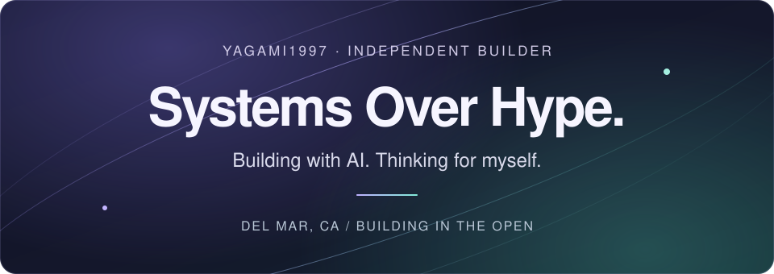

<p align="center">
  
</p>

<div align="center">

### Human curiosity. Agent capability.

Independent researcher and builder in Del Mar.<br/>
I build open-source tools and AI workflows, from the first question to something people can use.

Agents are part of how I work. The direction, the judgment, and the responsibility stay with me.

[Selected Projects](#selected-projects) &nbsp; / &nbsp; [How I Work](#how-i-work) &nbsp; / &nbsp; [Field Notes](#field-notes) &nbsp; / &nbsp; [Contact](#contact)

<br/>

## Now

What I'm building, exploring, and thinking through.

</div>

<table width="100%" align="center">
<tr>
<td width="33%" align="center" valign="top">

**BUILDING**

Tools for sharing, routing,<br/>and repeatable analysis.

[Explore the projects ↗](#selected-projects)

</td>
<td width="34%" align="center" valign="top">

**EXPLORING**

Useful context, bounded autonomy,<br/>and verifiable agent work.

[Inside the workflow ↗](#how-i-work)

</td>
<td width="33%" align="center" valign="top">

**WRITING**

AI, software, and keeping<br/>our own judgment.

[Read Field Notes ↗](#field-notes)

</td>
</tr>
</table>

<br/>

<div align="center">

## Selected Projects

Six projects. Different problems. Built to be opened, understood, and used.

</div>

<table width="100%" align="center">
<tr>
<td width="50%" valign="top">

<sub>CONTROLLED SHARING</sub>

### [BurnBox](https://github.com/yagami1997/BurnBox)

A private file workspace on Cloudflare Workers and R2. Share through links you can expire, limit, or revoke, with a separate private administration surface.

[Explore ↗](https://github.com/yagami1997/BurnBox) &nbsp; · &nbsp; [Documentation ↗](https://github.com/yagami1997/BurnBox/tree/main/docs)

</td>
<td width="50%" valign="top">

<sub>ENCRYPTED LINKS</sub>

### [VeilHub](https://github.com/yagami1997/VeilHub)

Self-hosted redirect links on Cloudflare Workers and KV. Destination URLs are encrypted at rest, keeping control of the link infrastructure with its operator.

[Explore ↗](https://github.com/yagami1997/VeilHub)

</td>
</tr>
<tr>
<td width="50%" valign="top">

<sub>NETWORK ROUTING</sub>

### [Arclane](https://github.com/yagami1997/Arclane)

Routing policies, compatibility modules, and operational reference tools. Includes Surge-compatible artifacts; independent and not affiliated with Nssurge Inc.

[Explore ↗](https://github.com/yagami1997/Arclane) &nbsp; · &nbsp; [Documentation ↗](https://github.com/yagami1997/Arclane/tree/main/docs)

</td>
<td width="50%" valign="top">

<sub>MARKET RESEARCH</sub>

### [TradeMind](https://github.com/yagami1997/TradeMind)

U.S. equity and ETF analysis, batch queries, indicators, backtest calculations, and local HTML reports. Terminal and browser workflows for research and learning.

[Explore ↗](https://github.com/yagami1997/TradeMind)

</td>
</tr>
<tr>
<td width="50%" valign="top">

<sub>TELECOM LOOKUP</sub>

### [RealCarrier](https://github.com/yagami1997/RealCarrier)

U.S. phone number carrier, number type, and portability lookup. Batch queries help make sense of numbers across providers and porting histories.

[Explore ↗](https://github.com/yagami1997/RealCarrier)

</td>
<td width="50%" valign="top">

<sub>ESIM UTILITIES</sub>

### [esimswap](https://github.com/yagami1997/esimswap)

Parse, generate, and repair eSIM QR codes in the browser. Camera scanning and configuration tools, with no backend.

[Explore ↗](https://github.com/yagami1997/esimswap)

</td>
</tr>
</table>

<br/>

<div align="center">

## How I Work

I set the direction. Agents help move the work forward. We check what actually works.

</div>

<table width="100%" align="center">
<tr>
<td width="50%" align="center" valign="top">

**01 &nbsp; DIRECTION**

Choose the problem worth solving.<br/>
Define the boundaries and what counts as done.

</td>
<td width="50%" align="center" valign="top">

**02 &nbsp; CONTEXT**

Bring the right code, sources, and tools.<br/>
Make constraints clear and knowledge reusable.

</td>
</tr>
<tr>
<td width="50%" align="center" valign="top">

**03 &nbsp; EXECUTION**

Match models and runtimes to the task.<br/>
Bound access and keep the work inspectable.

</td>
<td width="50%" align="center" valign="top">

**04 &nbsp; JUDGMENT**

Check tests, real outputs, and behavior.<br/>
Decide what ships and take responsibility for it.

</td>
</tr>
</table>

<p align="center">
  <sub>Context that carries forward &nbsp; · &nbsp; Tools that compose &nbsp; · &nbsp; Results that can be checked</sub>
</p>

<br/>

---

<div align="center">

## Field Notes

*Short takes on AI and software — updated as things shift.*

</div>

```
INBOX  [1 message]  ~/FieldNotes
━━━━━━━━━━━━━━━━━━━━━━━━━━━━━━━━━━━━━━━━━━━━━━━━━━━━━━━━━━━━━━━━━━━━━━━━━━━━━━━━━━━━━━━━━━━━━━━━━━━━━━━━
From : github.com/yagami1997
Date : Fri, 03 Apr 2026 04:25:46 -0700 (PDT)
Subj : From Anti-Microsoft to Anti-Black Box
━━━━━━━━━━━━━━━━━━━━━━━━━━━━━━━━━━━━━━━━━━━━━━━━━━━━━━━━━━━━━━━━━━━━━━━━━━━━━━━━━━━━━━━━━━━━━━━━━━━━━━━━

Twenty years ago, a Chinese programmer argued that engineers should face genuine complexity rather than
surrender to opaque encapsulation. Most people remember the surface: Linux good, use it.
The real argument was about posture — tools should help you understand the system, not
replace your understanding of it.

Twenty years later: we left Windows because it was too opaque, decided Linux was too much
trouble, and handed ourselves to the cloud and to AI. The black box never disappeared.
It became more comfortable, more seamless, and harder to question.

AI Agents are the largest single expansion of black box complexity in computing history.
A typical Agent chains models, tool calls, code execution, and sub-agents — dozens of steps,
none traceable in real time. When something goes wrong, "emergent behavior of a complex system"
is a complete sentence. It dissolves accountability entirely.

The counter-movement is quieter: the return of the command line — not as nostalgia, but as
the shared control plane between humans and AI. Structured. Auditable. Traceable. Standing
beside the Agent, not beneath it.

Three questions for any Agent product you adopt: Can you see each step? Can you identify where
it failed? Who is accountable? If none of those have answers, you are holding a larger black box.

--
yagami1997 | Del Mar, CA | building in the open
━━━━━━━━━━━━━━━━━━━━━━━━━━━━━━━━━━━━━━━━━━━━━━━━━━━━━━━━━━━━━━━━━━━━━━━━━━━━━━━━━━━━━━━━━━━━━━━━━━━━━━━━
[END OF MESSAGE]  n)ext  q)uit  r)eply  ?
```

→ Full essay: [From Anti-Microsoft to Anti-Black Box](FieldNotes/001-from-anti-to-box.md)

---

<div align="center">

## Contact

### Secure Contact

[](https://github.com/yagami1997/yagami1997/issues/new?title=Email%20Request&body=%23%23%20Request%20for%20Secure%20Communication%0A%0AI%20would%20like%20to%20establish%20an%20encrypted%20channel.%0A%0A-%20Reason%20for%20contact%3A%0A-%20Your%20GitHub%20background%3A%0A)

For general questions, ideas, or feedback — GitHub issues are the right place.

If you need to reach me privately, I only accept contact through GPG-encrypted channels. No plain email, no DMs.

Think of it as a small decryption puzzle — if you can play this game, we already speak the same language.

**To request a private channel:**

1. Click the GPG badge above to open an issue
2. Share your GPG public key block or 40-character fingerprint (must be on `keys.openpgp.org`)
3. I'll reply with my GPG fingerprint encrypted to your key — import it from `keys.openpgp.org` to find my address, then send encrypted email only

---

### Support

[](https://ko-fi.com/yagami1997)
[](https://patreon.com/yagami1997)

Support helps me keep building open-source tools, long-term projects, and practical software.

[](https://github.com/yagami1997)

Open to practical conversations around open-source AI, workflows, and useful software.

Del Mar, California · Last updated: 2026-09-04 20:06:24 PDT

</div>
