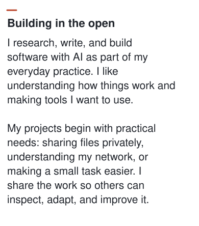
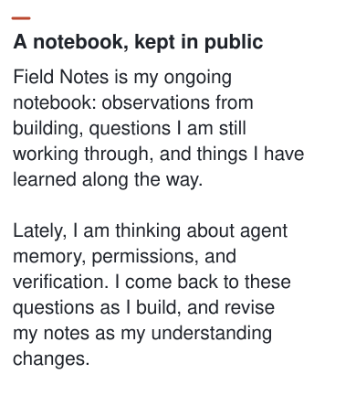
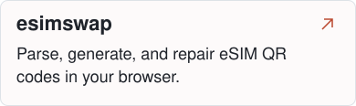
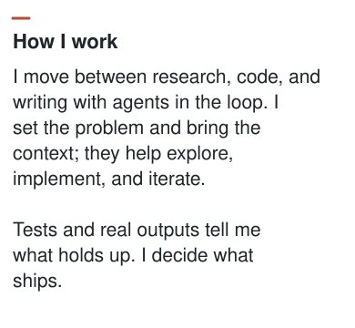
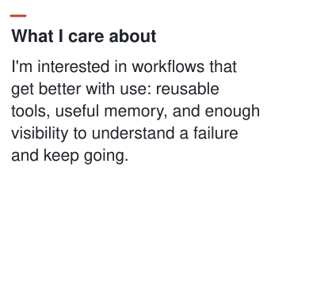
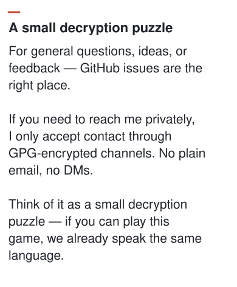
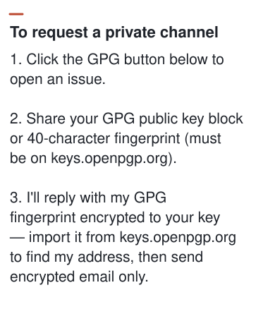

<h1 align="center">yagami1997</h1>
<h3 align="center">Independent builder · Del Mar, California</h3>
<p align="center">Research, writing, and open-source software — with AI in the loop.</p>

<p align="center">
<picture><source media="(prefers-color-scheme: dark)" srcset="assets/panel-intro-build-dark-1e4164356e.svg" /><source media="(prefers-color-scheme: light)" srcset="assets/panel-intro-build-light-29e4bfda98.svg" /></picture>
<picture><source media="(prefers-color-scheme: dark)" srcset="assets/panel-intro-notes-dark-eb206c49f9.svg" /><source media="(prefers-color-scheme: light)" srcset="assets/panel-intro-notes-light-ca3f0c0e66.svg" /></picture>
</p>

<p align="center">
<a href="#field-notes"><picture><source media="(prefers-color-scheme: dark)" srcset="assets/nav-notes-dark-c4702630bd.svg" /><source media="(prefers-color-scheme: light)" srcset="assets/nav-notes-light-315c5a6bd7.svg" /></picture></a>
<a href="#selected-projects"><picture><source media="(prefers-color-scheme: dark)" srcset="assets/nav-projects-dark-e695bfd2fa.svg" /><source media="(prefers-color-scheme: light)" srcset="assets/nav-projects-light-317746c86c.svg" /></picture></a>
<a href="#working-with-ai"><picture><source media="(prefers-color-scheme: dark)" srcset="assets/nav-ai-dark-dd40606db2.svg" /><source media="(prefers-color-scheme: light)" srcset="assets/nav-ai-light-e1f8bba04d.svg" /></picture></a>
<a href="#contact"><picture><source media="(prefers-color-scheme: dark)" srcset="assets/nav-contact-dark-933e295767.svg" /><source media="(prefers-color-scheme: light)" srcset="assets/nav-contact-light-6ee898ffe2.svg" /></picture></a>
</p>

---

<div align="center">

## Field Notes

*Short takes on AI and software — updated as things shift.*

</div>

```
INBOX  [1 message]  ~/FieldNotes
━━━━━━━━━━━━━━━━━━━━━━━━━━━━━━━━━━━━━━━━━━━━━━━━━━━━━━━━━━━━━━━━━━━━━━━━━━━━━━━━━━━━━━━━━━━━━━━━━━━━━━━━
From : github.com/yagami1997
Date : Fri, 03 Apr 2026 04:25:46 -0700 (PDT)
Subj : From Anti-Microsoft to Anti-Black Box
━━━━━━━━━━━━━━━━━━━━━━━━━━━━━━━━━━━━━━━━━━━━━━━━━━━━━━━━━━━━━━━━━━━━━━━━━━━━━━━━━━━━━━━━━━━━━━━━━━━━━━━━

Twenty years ago, a Chinese programmer argued that engineers should face genuine complexity rather than
surrender to opaque encapsulation. Most people remember the surface: Linux good, use it.
The real argument was about posture — tools should help you understand the system, not
replace your understanding of it.

Twenty years later: we left Windows because it was too opaque, decided Linux was too much
trouble, and handed ourselves to the cloud and to AI. The black box never disappeared.
It became more comfortable, more seamless, and harder to question.

AI Agents are the largest single expansion of black box complexity in computing history.
A typical Agent chains models, tool calls, code execution, and sub-agents — dozens of steps,
none traceable in real time. When something goes wrong, "emergent behavior of a complex system"
is a complete sentence. It dissolves accountability entirely.

The counter-movement is quieter: the return of the command line — not as nostalgia, but as
the shared control plane between humans and AI. Structured. Auditable. Traceable. Standing
beside the Agent, not beneath it.

Three questions for any Agent product you adopt: Can you see each step? Can you identify where
it failed? Who is accountable? If none of those have answers, you are holding a larger black box.

--
yagami1997 | Del Mar, CA | building in the open
━━━━━━━━━━━━━━━━━━━━━━━━━━━━━━━━━━━━━━━━━━━━━━━━━━━━━━━━━━━━━━━━━━━━━━━━━━━━━━━━━━━━━━━━━━━━━━━━━━━━━━━━
[END OF MESSAGE]  n)ext  q)uit  r)eply  ?
```

→ Full essay: [From Anti-Microsoft to Anti-Black Box](FieldNotes/001-from-anti-to-box.md)

---

## Selected Projects

<p align="center">
<a href="https://github.com/yagami1997/BurnBox"><picture><source media="(prefers-color-scheme: dark)" srcset="assets/project-burnbox-dark-73403f5a65.svg" /><source media="(prefers-color-scheme: light)" srcset="assets/project-burnbox-light-a7cc21ce31.svg" /></picture></a>
<a href="https://github.com/yagami1997/VeilHub"><picture><source media="(prefers-color-scheme: dark)" srcset="assets/project-veilhub-dark-a9f2e25fcc.svg" /><source media="(prefers-color-scheme: light)" srcset="assets/project-veilhub-light-6dcc5467b6.svg" /></picture></a>
<a href="https://github.com/yagami1997/Arclane"><picture><source media="(prefers-color-scheme: dark)" srcset="assets/project-arclane-dark-95f7672bb2.svg" /><source media="(prefers-color-scheme: light)" srcset="assets/project-arclane-light-6cad2b2e4f.svg" /></picture></a>
<a href="https://github.com/yagami1997/TradeMind"><picture><source media="(prefers-color-scheme: dark)" srcset="assets/project-trademind-dark-14fbd43624.svg" /><source media="(prefers-color-scheme: light)" srcset="assets/project-trademind-light-0d174e0824.svg" /></picture></a>
<a href="https://github.com/yagami1997/RealCarrier"><picture><source media="(prefers-color-scheme: dark)" srcset="assets/project-realcarrier-dark-9d77f5a307.svg" /><source media="(prefers-color-scheme: light)" srcset="assets/project-realcarrier-light-9f7a92c945.svg" /></picture></a>
<a href="https://github.com/yagami1997/esimswap"><picture><source media="(prefers-color-scheme: dark)" srcset="assets/project-esimswap-dark-2595160bad.svg" /><source media="(prefers-color-scheme: light)" srcset="assets/project-esimswap-light-f158be0d8e.svg" /></picture></a>
</p>

Arclane is independent third-party research with Surge-compatible artifacts; not affiliated with Nssurge Inc. TradeMind is for research and learning.

## Working with AI

<p align="center">
<picture><source media="(prefers-color-scheme: dark)" srcset="assets/panel-ai-practice-dark-b1f3f99568.svg" /><source media="(prefers-color-scheme: light)" srcset="assets/panel-ai-practice-light-212d3b3ec5.svg" /></picture>
<picture><source media="(prefers-color-scheme: dark)" srcset="assets/panel-ai-learning-dark-f760182525.svg" /><source media="(prefers-color-scheme: light)" srcset="assets/panel-ai-learning-light-b539418312.svg" /></picture>
</p>

## Contact

<p align="center">
<picture><source media="(prefers-color-scheme: dark)" srcset="assets/panel-contact-public-dark-9b1744a6a9.svg" /><source media="(prefers-color-scheme: light)" srcset="assets/panel-contact-public-light-383c075358.svg" /></picture>
<picture><source media="(prefers-color-scheme: dark)" srcset="assets/panel-contact-steps-dark-59a0eecd86.svg" /><source media="(prefers-color-scheme: light)" srcset="assets/panel-contact-steps-light-e5114b24fe.svg" /></picture>
</p>

<p align="center">
<a href="https://github.com/yagami1997/yagami1997/issues/new?title=Email%20Request&body=%23%23%20Request%20for%20Secure%20Communication%0A%0AI%20would%20like%20to%20establish%20an%20encrypted%20channel.%0A%0A-%20Reason%20for%20contact%3A%0A-%20Your%20GitHub%20background%3A%0A"><picture><source media="(prefers-color-scheme: dark)" srcset="assets/action-gpg-dark-b2903ade7c.svg" /><source media="(prefers-color-scheme: light)" srcset="assets/action-gpg-light-c525ed4979.svg" /></picture></a>
</p>

<div align="center">

## Support

Support helps me keep building open-source tools, long-term projects, and practical software.

<a href="https://ko-fi.com/yagami1997"><picture><source media="(prefers-color-scheme: dark)" srcset="assets/action-kofi-dark-c96a6812d9.svg" /><source media="(prefers-color-scheme: light)" srcset="assets/action-kofi-light-655d204431.svg" /></picture></a>
<a href="https://patreon.com/yagami1997"><picture><source media="(prefers-color-scheme: dark)" srcset="assets/action-patreon-dark-4d3ba1c4c0.svg" /><source media="(prefers-color-scheme: light)" srcset="assets/action-patreon-light-1862b269a1.svg" /></picture></a>

Open to practical conversations around open-source AI, workflows, and useful software.

[GitHub · @yagami1997](https://github.com/yagami1997)

Del Mar, California · Last updated: 2026-09-04 20:50:31 PDT

</div>
